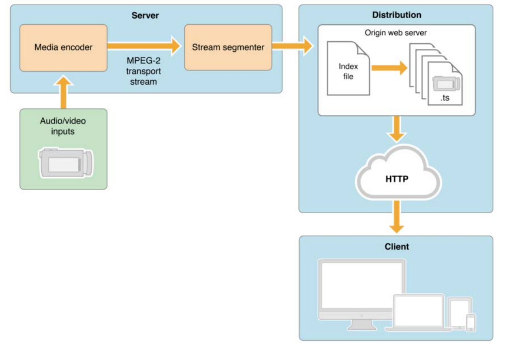
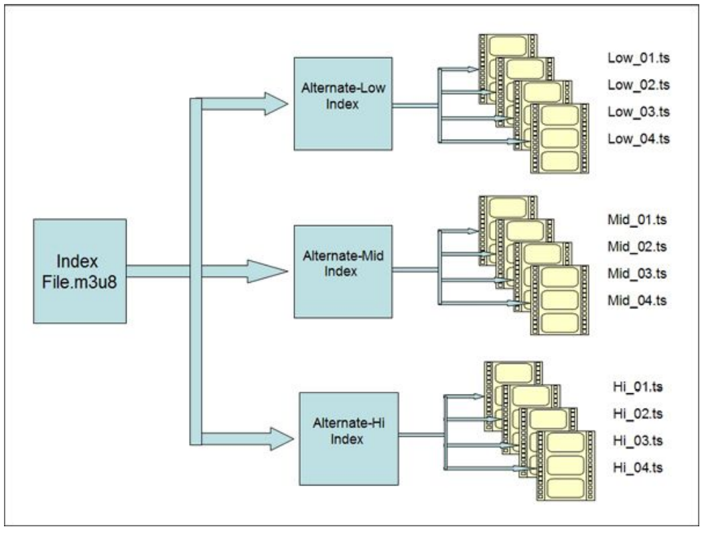
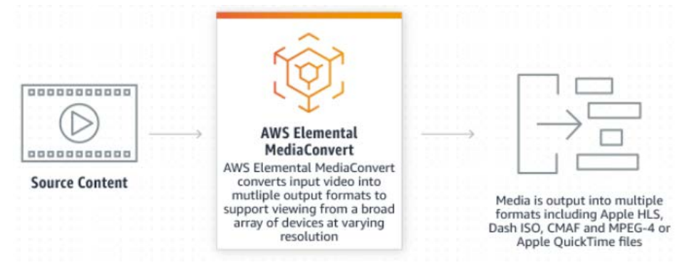

\setcounter{figure}{0}

# Etude exploratoire pour la production de Médias interactifs
_Evan, David_

_Le-Point-Technique_, _June/2022_

__abstract__: Ce document est une étude exploratoire des solutions pour la production de médias interactifs - type vidéos 360 ou avec scénario. 

__keywords__: Etude exploratoire, médias interactifs, Unity, AWS Elemental Media Store

## Introduction

Dans cette étude, nous nous intéressons aux différentes options architecturales pour l'implémentation d'un système informatique destiné a la production de médias interactifs, comme la production de vidéos 360 ou avec scénario.

## Choix préférés pour les outils et technologies

Bien que les solutions puissent être des conceptions « from scratch », **les solutions préexistantes** seront 
favorisées dès lorsqu’ils répondent aux besoins définis dans le cahier des charges et que la tarification est 
adaptée. Cette approche vise à permettre d’assurer une livraison rapide du projet, une réduction des 
coûts de mise en œuvre et favorise une approche modulaire.

Les choix d’outils et de technologies retenues devront répondre à des critères de cohérence d’ensemble. 
Les solutions compatibles les unes par rapport aux autres et/ou facilement interopérables seront 
préférées. Cette approche vise à favoriser l'évolutivité de l’architecture retenue.

Notons que les critères de popularités des outils, de facilité à trouver des ressources et des profils de 
collaborateurs expérimentés seront aussi analysés pour le choix des solutions.

Le coût des licences et l’adéquation au budget du projet (non défini au moment de la rédaction de ce 
document) seront pris en compte pour le choix final des solutions.

## Technologies pour la diffusion des médias vidéo sur le web

Le streaming de médias vidéo (interactifs ou non) sur le web nécessite l’utilisation de formats adaptés afin 
de garantir la meilleure qualité selon les performances de la connexion internet de l’utilisateur final.

Les protocoles disposant d’un bitrate adaptatifs seront préférés afin de satisfaire à cette exigence.

### Protocoles HLS et DASH

Les protocoles HLS et MPEG-DASH seront retenus comme technologie de diffusion pour le projet de média 
interactif.

De manière simplifiée, HLS (*HTTP Live Streaming*) et DASH (*Dynamic Adaptive Streaming over HTTP*) sont 
deux protocoles de streaming audio / vidéo basé sur HTTP et visant à délivrer des médias à l’utilisateur en 
« fragmentant » les fichiers d’origines en plusieurs « sous-fichiers » de qualités différentes afin de fournir 
le plus adapté à l’utilisateur en fonction de l’avancement de sa visualisation.

HLS et DASH supportent tous deux les principaux codec audio / vidéo de l’industrie : *VP9, AAC-LC, FLAC, 
H.265, H.264* … (*non-exhaustif*).

Le protocole DASH embarque plusieurs fonctionnalités supplémentaires par rapport au HLS, notamment 
la possibilité d’utiliser des DRM sur les médias transportés.

Bien que l'implémentation de DASH soit relativement plus complexe, le fonctionnement général est 
relativement similaire. _(DASH ne sera pas approfondi dans cette section. Si nécessaire, des ressources 
documentaires sont disponible en fin de section pour approfondir la compréhension de ces technologies)_

Le schéma ci-après (_Figure 1_) présente de façon simplifiée le fonctionnement d’un flux HLS :

> 
> <pre>
> Figure 1: Vue synthétique d'un envoi réalisé avec HLS (source : Eleven Labs Blog).
> </pre>

Comme indiqué précédemment, la découpe des fichiers source en segments de qualité différentes permet 
l’adaptation du bitrate de la diffusion au fur et à mesure de l'avancé afin de garantir à l’utilisateur une 
lecture fluide en sacrifiant la qualité sur certains passage (lorsque la connexion de l’utilisateur n’arrive 
plus à supporter le flux).

Un manifeste est fourni en complément et permet de décrire au client (navigateur web) comment 
construire la vidéo.

La figure ci-après (_Figure 2_) montre le fonctionnement du principe de segmentation du fichier source en 
section différentes.

> 
> <pre>
> Figure 2: Segmentation d’un média en différentes qualités pour diffusion via HLS (source : Eleven Labs Blog).
> </pre>

**Documentation complémentaire :**

- https://www.wowza.com/blog/mpeg-dash-dynamic-adaptive-streaming-over-http

- https://blog.eleven-labs.com/fr/video-live-dash-hls

## Technologies pour l’authentification / l’autorisation

Afin de disposer d’une solution évolutive et pour permettre de simplifier l’ensemble des mécanismes 
d’authentification et d’autorisation, les technologies OAuth2 et sa couche d’identité OIDC (*Open ID 
Connect*) seront utilisées pour la gestion des accès aux ressources via un mécanisme de jeton d’accès 
(*access_tokens*). 

Les niveaux d’autorisation seront gérés à l’aide des scopes embarqués dans les jetons OAuth2 et les profils 
utilisateurs à l’aide des jetons d’identité (*id_tokens*). *Étant hors du scope de ce document de définition 
d’architecture, les mécanismes de fonctionnement de l’authentification / autorisation seront abordés dans 
les spécifications techniques.*

**Documentation complémentaire :**

- https://datatracker.ietf.org/doc/html/rfc6749

- https://openid.net/connect/

## Briques de solution de référence (SBB)

### Solution : Production des médias interactifs (SBB-1)

La production de médias interactifs nécessite l’utilisation d’outils complets et performants afin de couvrir 
l’ensemble des besoins décrits dans le cahier des charges d’architecture (vidéo 360, vidéo interactives, 
multi-view …). 

Notons par ailleurs que la production de vidéo 360° nécessite par ailleurs des outils complémentaires pour 
la capture, le stitching et le montage des séquences.

Le logiciel **Unity** (et sa plateforme) sera retenu comme outil de production de médias interactif. Ce logiciel 
offre une gamme très large d’outils pour la création de média et couvre 100% des besoins définis. Notons 
qu’un système de « plugins » téléchargeable via le **Unity Asset Store** permet d’enrichir les fonctionnalités 
offertes par le logiciel de base.

**Documentation complémentaire :**

- https://unity.com/fr/solutions/film-animation-cinematics

- https://unity.com/fr/solutions/360video

- https://assetstore.unity.com/

### Solution : Transcodage / Convertisseur média (SBB-2)

L’un des besoins décrits dans les briques d’architecture de référence consiste dans le transcodage des 
médias produits (format de sortie de l’outil de production) au format compatible avec la diffusion sur le 
web (par exemple, HLS / DASH comme décrit dans les technologies retenues).

La solution **AWS Elemental Media Converter** (_Figure 3_) sera utilisée pour la conversion des médias sources. Cet 
outil couvre l’intégralité des besoins nécessaires au projet et s’adapte au volume nécessaire (tarification 
à la minute convertie). Le workflow peut être automatisé et couplé avec AWS S3 pour automatiser 
l’ensemble de chaîne et libérer les créateurs de contenu de ce travail.

> 
> <pre>
> Figure 3:  Fonctionnement d'AWS Elemental Media Converter (Source : AWS).
> </pre>

**Documentation complémentaire :**

- https://aws.amazon.com/fr/mediaconvert/

### Solution : Stockage des médias (SBB-3)

Afin de permettre le stockage de l’ensemble des médias produits et en attente de diffusion (version drafts, 
médias non publiés …) ainsi que les ressources nécessaires à la production (audio, vidéos brutes …), un 
espace de stockage de haute capacité est nécessaire.

La solution **AWS S3** (*Simple Storage Service*) sera retenue. Cette solution répond parfaitement aux besoins 
de la société tout en permettant une intégration simplifiée au système d’autorisation basé sur les rôles 
(identique pour les clients et les collaborateurs) afin de garantir la sécurité du contenu.

Cette solution est totalement évolutive et garantit une adaptation parfaite aux besoins grandissant de 
l’entreprise. Le SLA extrêmement important garantit la disponibilité des données.

**Documentation complémentaire :** 

- https://aws.amazon.com/fr/s3/

### Solution : Diffusion de média sur le web (SBB-4)

La diffusion sur de média sur le web à grande échelle nécessite de prendre en compte les besoins de haute 
disponibilité, de régularité et de faible latence pour la distribution du contenu. Le service doit par ailleurs 
disposer de fonctionnalités de scalabilité automatique afin de s’adapter aux pics de diffusion.
Plusieurs options peuvent être envisagées pour le choix de la brique de solution retenu pour 
l’architecture.

#### Option 1 : Solution AWS Elemental MediaStore

**AWS Elemental Media Store** est un service fourni par la plateforme AWS et est spécialisé dans le stockage 
et la distribution de vidéo. Il fournit un point de stockage et assure la diffusion des médias tout en 
s’adaptant automatiquement à la demande.

L’intégration avec les autres services AWS (*IAM* et *CDN* par exemple) en fait une solution de choix pour 
l’architecture du projet. Notons que la tarification pour la plateforme peut toutefois devenir un frein à la 
croissance de l’entreprise notamment pour le contenu non premium et faiblement monétisable.

**Documentation complémentaire :**

- https://aws.amazon.com/fr/mediastore/

#### Option 2 : Solution Unity Multiplay / Unity Build Server

La plateforme Unity embarque une solution alternative, **Unity Multiplay**. Cette solution fournit une 
plateforme auto-scalable initialement prévue pour la diffusion de jeux vidéo mais pouvant parfaitement 
couvrir nos besoins de diffusion de média à haute échelle.

Unity Multiplay offre l’avantage de s’intégrer aux service **Unity Build Server** permettant d’envisager la 
création de l’intégralité de la couche «front-end » avec Unity (C#).

Par ailleurs, l’absence de tarification sur les flux de données entrant / sortant peut représenter une source 
importante d’économie. 

Notons toutefois que cette plateforme impose plusieurs choix technologiques, notamment sur l'OS 
embarqué (Windows Server 2012, Windows Server 2019 ou Ubuntu 18.04) et dispose d’une communauté 
et d’une documentation moins importante que la solution AWS.

**Documentation complémentaire :**

- https://unity.com/fr/products/multiplay

- https://docs.unity.com/multiplay/shared/welcome-to-multiplay.html

#### Avantages et inconvénients des deux options

<pre>
+------------------+----------------------------+------------------------------------------------------------------------------+---------------------------------------------------------------------------------+
| **Option**       |      **Solution**          | **Avantages**                                                                | **Inconvénients**                                                               |
+:=================+:===========================+:============================================================================:+:===============================================================================:+
| **1**            |  AWS Elemental Media Store | - Totalement intégré à l’écosystème AWS (Ressources et autres services)      | - Pas de personnalisation possible des services.                                |
|                  |                            | - Auto-scalable                                                              | - Peut nécessiter l’ajout de frontaux (CDN)                                     |
|                  |                            | - Très hautes performances                                                   | - Tarification sur le stockage et sur les flux de données entrant / sortant     |
|                  |                            | - Disponible sous forme de service                                           |                                                                                 |
|                  |                            | - Faible configuration (SaaS)                                                |                                                                                 |
+------------------+----------------------------+------------------------------------------------------------------------------+---------------------------------------------------------------------------------+
| **2**            |  Unity Multiplay           | - Totalement personnalisable                                                 | - Configuration et intégration pouvant être complexe (IaaS)                     |
|                  |                            | - Tarification avantageuse (uniquement sur les performance de la plateforme) | - Peu de ressources documentaires                                               |
|                  |                            | - Auto-scalable                                                              | - Peut être intégré au workflow automatisé mais nécessite un travail important. |
|                  |                            | - Intégration des frontaux de base.                                          |                                                                                 |
+------------------+----------------------------+------------------------------------------------------------------------------+---------------------------------------------------------------------------------+

#### Choix de la solution

Les deux solutions présentées pour la diffusion de média peuvent être retenues pour la conception de 
l’architecture. 

Au vu des enjeux du projet, il semble nécessaire de réaliser un **PoC** sur la solution Unity afin de garantir
sa cohérence vis-à-vis du projet et permettre ainsi un ROI substantiel par rapport à la solution AWS.

### Solution : Authentification / Autorisation (SBB-5)

L’autorisation et l’authentification nécessite de faire appel à une solution IAM (Identity Access Manager) 
compatible avec les standards OAuth2 et OIDC afin de disposer d’une couche « universelle » 
d’authentification / d’identification / d’autorisation. 

Bien que de nombreuses solutions soient envisageables (Okta, Gravitee, Azure AD …), la solution **AWS Cognito** sera retenue. Ce choix se justifie par sa parfaite intégration à l’environnement AWS permettant 
de facilement configurer les autres services (*S3, Media Converter, Media Store, API Gateway …*) pour 
prendre en compte les règles à appliquer.

**Documentation complémentaire :** 

- https://aws.amazon.com/fr/cognito/

### Solution : Visualisation des médias (SBB-6)

La visualisation des médias doit répondre à deux caractéristiques : Fournir une plateforme web pour la 
présentation des médias (ex : SPA,  WebApp) et fournir les outils, notamment le player vidéo, compatibles
avec l’ensemble des exigences fonctionnelles : lecture de média disposant d’une interaction avec 
l’utilisateur, vidéo « 360 » (l’utilisateur peut « déplacer » la caméra), support HLS / DASH ...

La contrainte du multi-plateforme doit être respectée afin que la WebApp puisse être facilement 
accessible depuis les supports désignés dans les exigences non fonctionnelles du cahier des charges 
d’architecture.

**La WebApp sera développée en interne (« from scratch »)** en utilisant les technologies adaptés (React, 
Vue.Js, Angular pour le front-end, Java Spring, PHP Laravel / Symfony pour le back-end) en fonction de 
l’écosystème de l’entreprise et de l’expertise des développeurs.

La solution **NexPlayer** sera retenue comme player vidéo. Cette solution se présente sous la forme d’un 
SDK permettant de créer un player vidéo totalement personnalisable à partir d’une solution couvrant la 
totalité des besoins exprimés (vidéo 360, multi-view, Dynamic Streaming …)

Ce choix se justifie par plusieurs critères : 
- Le player vidéo couvre l’ensemble des besoins décrit dans le cahier des charges.
- La solution est totalement personnalisable, permettant à l’entreprise de pouvoir créer sa propre 
UI adaptée à l’image de marque, voire de développer de nouvelles fonctionnalités.
- L’outil est open source et dispose d’une implémentation sur les principales plateformes (Web 
HTML5, Application mobiles, consoles de jeux, smart TV …)
- Le player dispose d’une excellente implémentation dans les outils Unity.

**Documentation complémentaire :**

- https://nexplayersdk.com/

- https://github.com/NexPlayer/NexPlayer_Unity_Plugin

## Synthèse de l’étude de la stack technologique

### Catalogue des briques de solution de référence

<pre>
+---------------+-----------------------+-----------------------------------+-----------------------------------+
| **Id. SBB**   | **Référence aux ABB** | **Solution**                      | **Rôle**                          |
+===============+=======================+===================================+===================================+
| **SBB-1**     | ABB-1                 | Unity                             | Production médias interactif      |
+---------------+-----------------------+-----------------------------------+-----------------------------------+
| **SBB-2**     | ABB-2                 | AWS Elemental Media Converter     | Transcodage / Convertisseur media |
+---------------+-----------------------+-----------------------------------+-----------------------------------+
| **SBB-3**     | ABB-3                 | AWS S3 (*Simple Storage Service*) | Stockage des médias               |
+---------------+-----------------------+-----------------------------------+-----------------------------------+
| **SBB-4-A**   | ABB-4                 | AWS Elemental MediaStore          | Diffusion de média sur le web     |
+---------------+-----------------------+-----------------------------------+-----------------------------------+
| **SBB-4-B**   | ABB-4                 | Unity Multiplay                   | Diffusion de média sur le web     |
+---------------+-----------------------+-----------------------------------+-----------------------------------+
| **SBB-5**     | ABB-5                 | AWS Cognito                       | Authentification / Autorisation   |
+---------------+-----------------------+-----------------------------------+-----------------------------------+
| **SBB-6**     | ABB-6                 | 1. Solution custom (Web App)      | Visualisation des médias          |
|               |                       | 2. NextPlayer (Player vidéo)      |                                   |
+---------------+-----------------------+-----------------------------------+-----------------------------------+

### Implémentation de la stack technologique

l'implémentation de la stack technologique proposée vise à exploiter au maximum des services déjà 
disponibles pour faciliter l'implémentation et accélérer les livraisons. L’ensemble des composants 
déployés devront être redondés afin de garantir la continuité de service en cas de défaillance ou de 
maintenance sur tout ou partie des composants.

Des composants additionnels (base de données SQL / NoSQL, MoM, Back-end API) seront probablement 
nécessaires pour compléter la solution (notamment la web app). 

Notons toutefois, ces aspects sortent de la définition de l’architecture et seront précisés lors de la 
rédaction des spécifications techniques que chaque composants.

## Références
Wowza Media Systems. ‘MPEG-DASH: Dynamic Adaptive Streaming Over HTTP Explained’, 18 April 2022. [https://www.wowza.com/blog/mpeg-dash-dynamic-adaptive-streaming-over-http](https://www.wowza.com/blog/mpeg-dash-dynamic-adaptive-streaming-over-http).

Bernard, Jérémy. ‘Les principaux formats de flux video live DASH et HLS’. Blog Eleven Labs, 19 July 2017. [https://blog.eleven-labs.com/fr/video-live-dash-hls/](https://blog.eleven-labs.com/fr/video-live-dash-hls/).

Hardt, Dick. ‘The OAuth 2.0 Authorization Framework’. Request for Comments. Internet Engineering Task Force, October 2012. [https://doi.org/10.17487/RFC6749](https://doi.org/10.17487/RFC6749).

‘OpenID Connect | OpenID’, 1 August 2011. [http://openid.net/connect/](http://openid.net/connect/).

Technologies, Unity. ‘Logiciel d’animation en 3D pour le cinéma et la télévision | Unity’. Accessed 29 June 2022. [https://unity.com/fr/solutions/film-animation-cinematics](https://unity.com/fr/solutions/film-animation-cinematics).

‘Créez Des Expériences Vidéo Immersives En 360° | Unity’. Accessed 29 June 2022. [https://unity.com/fr/solutions/360video](https://unity.com/fr/solutions/360video).

‘Unity Asset Store - The Best Assets for Game Making’. Accessed 29 June 2022. [https://assetstore.unity.com/](https://assetstore.unity.com/).

‘AWS Elemental MediaConvert’. Accessed 29 June 2022. [https://aws.amazon.com/fr/mediaconvert/](https://aws.amazon.com/fr/mediaconvert/).

Amazon Web Services, Inc. ‘AWS | Amazon S3 – Stockage de données en ligne dans le cloud’. Accessed 29 June 2022. [https://aws.amazon.com/fr/s3/](https://aws.amazon.com/fr/s3/).

Amazon Web Services, Inc. ‘AWS Elemental MediaStore’. Accessed 29 June 2022. [https://aws.amazon.com/fr/mediastore/](https://aws.amazon.com/fr/mediastore/).

‘Hébergement de Serveur de Jeu Multijoueur | Unity Multiplay’. Accessed 29 June 2022. [https://unity.com/fr/products/multiplay](https://unity.com/fr/products/multiplay).

‘Welcome to Multiplay’. Accessed 29 June 2022. [https://docs.unity.com/multiplay/shared/welcome-to-multiplay.html](https://docs.unity.com/multiplay/shared/welcome-to-multiplay.html).

Amazon Web Services, Inc. ‘AWS | Amazon Cognito - gestion des accès et synchronisation des données’. Accessed 29 June 2022. [https://aws.amazon.com/fr/cognito/](https://aws.amazon.com/fr/cognito/).

NexPlayer. ‘NexPlayer | The Premium Multiscreen Player SDK for Video Apps’. Accessed 29 June 2022. [https://nexplayersdk.com/](https://nexplayersdk.com/).

Wade, Noah. NexPlayer_Unity_Plugin. 2017. Reprint, NexPlayer, 2017. [https://github.com/NexPlayer/NexPlayer_Unity_Plugin](https://github.com/NexPlayer/NexPlayer_Unity_Plugin).