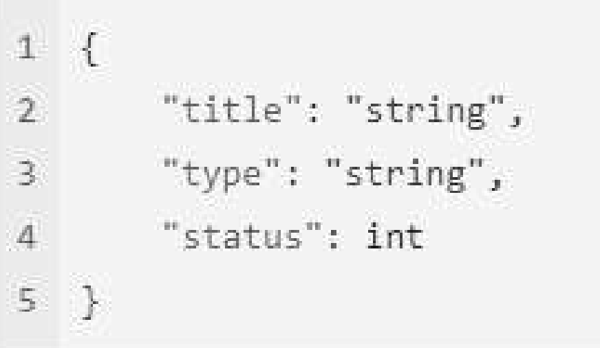

\setcounter{figure}{0}

# Architecture: API REST & HTTP

_Evan, David_

_Le-Point-Technique_, _November/2022_

__abstract__: Le présent article vise à présenter les conventions communes à la construction des API REST. Elle est 
issue d’un ensemble de bonnes pratiques communément appliquées et d’expériences accumulées sur la 
création des API REST.

__keywords__: API, REST, HTTP

## Architecture REST

### Manipulation des ressources

Lors de la conception des API, les règles suivantes s’appliquent : 
- Les URL doivent être construites conformément aux règles & bonnes pratiques de l’architecture REST. Les identifiants des ressources doivent être passés en route param.
- Les ressources présentes dans les URLS seront systématiquement écrites au pluriel, même si une seule ressource est accessible.
_Exemple_ : `/contract/v1/contracts/123456789`
- Toutes les ressources d’un même service doivent impérativement partager un vocabulaire commun. Un champ représentant une donnée (exemple : Prix HT) doit disposer de la même “traduction”, peu importe l’API utilisé au sein de ce service et / ou le modèle utilisé, tant que la donnée possède le même sens.

### Convention de nommage des URLs

Les conventions de nommages s’appliquent principalement à la nomenclature des URLs accessibles et composant les services API.
- Utilisation de la convention de nommage [Kebab Case](https://medium.com/better-programming/string-case-styles-camel-pascal-snake-and-kebab-case-981407998841). 
- Utilisation de la langue __anglaise__ pour le nommage des services, fonctions, attributs, ressources …
- Des __ressources__ (et non des fonctions) doivent être utilisés dans les URLs (exemple `/contracts` et non `/getallcontracts`)
- Le nom des attributs composant une ressource devrait être différent des noms des champs de la base de données auxquels ils font référence

## Utilisation HTTP

### Verbes HTTP

L’utilisation des verbes HTTP devra respecter la spécification ci-dessous, et, plus généralement, le sens de chaque méthode HTTP tel que décrit dans la [section 4.3 de la RFC 7231](https://tools.ietf.org/html/rfc7231#section-4.3) (_Table 1_)

_Table 1: Utilisation des verbes HTTP pour la construction des APIs_

<pre>
+---------------+---------------+
| VERBE         | DESCRIPTION   | 
+===============+===============+
| Bananas       | $1.34         |
|               |               |
+---------------+---------------+
| Oranges       | $2.10         |
|               |               |
+---------------+---------------+

### Entêtes HTTP

### Code statut HTTP

## Convention de création pour les API

### Règles communes

### API Paginées

### API de recherche

### Authenticated API

## Données manipulées par les services

### Format d'échange

### Gestion des Entrées/Sorties

#### Contrôles d’intégrité des données

#### Manipulation des données par les services API

## Gestion des erreurs

### Normalisation de la sortie d’erreur (API Problem)

## Stockage des erreurs (logs)

## Version des API

### Version d’une API

### Teneu d'un CHANGELOG

## Documentation API

## Introduction

l'application (_Figure 1_).

> 
> <pre>
> Figure 1: La librairie se présente sous la forme d’un bouton a intégrer a l’application.
> </pre>

## References

https://medium.com/better-programming/string-case-styles-camel-pascal-snake-and-kebab-case-981407998841

https://tools.ietf.org/html/rfc7231#section-4.3
