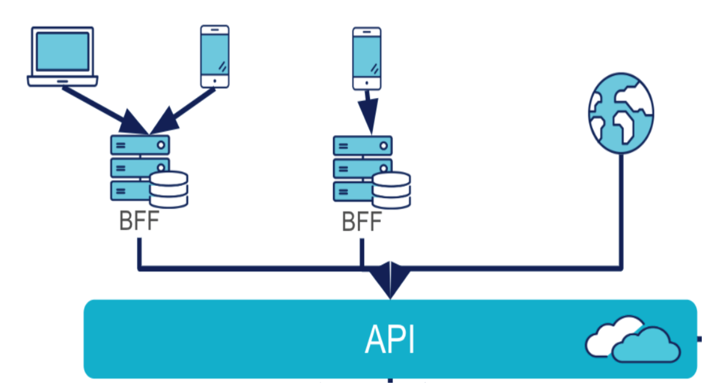

\setcounter{figure}{0}

# Backend For Frontend : Notes

_LeFrançois, Marc_

_Le-Point-Technique_, _January/2023_

__abstract__: L’utilisation d’une couche ou application BFF (Backend For Frontend) est utile lorsque le système possède des interfaces différentes, afin d’avoir un rendu de données spécifique en fonction du besoin de chacune desdites interfaces. Cela présente notamment l’avantage d'économiser de la bande passante via l'optimisation des requêtes suivants le besoin ; c’est le travail que fait le BFF. 

__keywords__: Backend For Frontend (BFF), Pattern, Software Architecture

## Avantages

- Une séparation nette des responsabilités entre développeur backend et frontend :
	- Les développeurs backend mettront à disposition des API “générique” et contenant des données brutes.
	- Tandis que les développeurs frontend pourront spécifier leurs besoins de données en fonction des interfaces.
- Optimisation des requêtes selon les besoins.
- La maintenance corrective spécifiques pour chaque BFF/interfaces.
- L’isolation de chaque interface et leur BFF associé
- Les developpeurs frontend peuvent faire évoluer les requêtes suivants leur convenance.
- Le bakend quant à lui fourni une API qui est indépendante des interfaces.
- Certaines données sensibles peuvent être cachées à des clients spécifiques. 

## Inconvénients 

- Une couche et un service supplémentaire à déployer, maintenir et superviser.
- L’ajout d’une couche peut engendrer une augmentation légère de la latence.
- Les développeurs frontend doivent gérer en supplément un backend.
- Duplication de code.

## Implémentation

La _Figure 1_ contient un schéma générique d'une implémentation BFF.

> 
> <pre>
> Figure 1: Schéma générique d'un BFF.
> </pre>

Afin de pallier du mieux possible aux inconvénients vus plus haut, une alternative est la creation d'un BFF unique par interface et pour plusieurs entrées (p.ex. site Web et l’application mobile), notamment via l’utilisation de la solution [GraphSQL](https://blog.octo.com/graphql-et-pourquoi-faire/), qui permet de n’avoir qu’une seule couche BFF pour des entrées multiples.

Une seule interface connectée à un unique BFF, et accessible via plusieurs entrées ou terminaux (fixe et mobile), permettrait (en plus des avantages deja su-mentionnes):
- de limiter la duplication de code, de la standardiser notamment avec du [HTML 5](https://www.w3schools.com/html/) ;
- de limiter la latence, limitant le nombre d’interfaces et donc de BFFs ;
- de faciliter la maintenance, pour les mêmes raisons susmentionnées, et de fait d’alléger la charge de travail des développeurs frontend.

## Référence

A. Bhayani, ‘BFF - Backend for Frontend - Pattern in Microservices | LinkedIn’. [https://www.linkedin.com/pulse/bff-backend-frontend-pattern-microservices-arpit-bhayani/](https://www.linkedin.com/pulse/bff-backend-frontend-pattern-microservices-arpit-bhayani/).

P. Trollé, ‘Les indispensables d’un projet frontend - Un Backend For Frontend, une API sur-mesure’, OCTO Talks !, Jan. 11, 2019. [https://blog.octo.com/les-indispensables-dun-projet-frontend-un-backend-for-frontend-une-api-sur-mesure/](https://blog.octo.com/les-indispensables-dun-projet-frontend-un-backend-for-frontend-une-api-sur-mesure/).

R. Calamier, ‘GraphQL: Et pour quoi faire ?’, OCTO Talks !, Aug. 09, 2018. [https://blog.octo.com/graphql-et-pourquoi-faire/](https://blog.octo.com/graphql-et-pourquoi-faire/).
