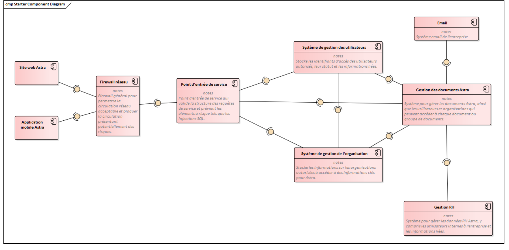

\setcounter{figure}{0}

# OUTILS DE COLLABORATION WEB : Étude exploratoire  
_Marc Lefrançois_  

_Le-Point-Technique_, _01/2024_  

__abstract__: Étude exploratoire des solutions de collaboration Web (visioconférence et partage de fichiers) avec analyse du marché, comparaison architecturale et recommandations pour la société Astra Recherche.

__keywords__: visioconférence, partage de fichiers, architecture logicielle, NextCloud, Jitsi

---

## 1. Objet
Le présent document concerne l’étude exploratoire dans le cadre d’une solution Web de collaboration, réunion et présentation pour la société Astra Recherche. Son objectif est de présenter les différentes options d'architecture et d'étudier les différentes solutions pour les composants de visioconférences et de partage de fichier.  

---

## 2. Situation actuelle

### 2.1. Diagramme de composant
Veuillez consulter _Figure 1_.  

> 
> <pre>
> Figure 1 : Diagramme de composant de l’architecture IT actuelle d’Astra Recherche
> </pre>

### 2.2. Description du diagramme de composant
- **Site web Astra** : application web réactive affichant des informations publiques et protégées par login, accessible depuis tout type d’appareil.  
- **Application mobile Astra** : application Android/iOS offrant accès mobile aux données Astra et un stockage limité de documents.  
- **Firewall réseau** : protège les systèmes Astra et filtre les accès par port 80 pour les services exposés.  
- **Point d’entrée de service** : vérifie l’accès des utilisateurs aux services autorisés.  
- **Système de gestion des utilisateurs** : gère les permissions, rôles et authentifications.  
- **Système de gestion de l’organisation** : gère les organisations autorisées et l’accès aux données associées.  
- **Email** : service interne de messagerie et emails transactionnels.  
- **Gestion des documents Astra** : protection et accès contrôlé aux documents selon rôles et autorisations.  
- **Gestion RH** : gestion des utilisateurs internes (rôle, département, permissions).  

### 2.3. Remarques sur le diagramme de composant
- L’architecture des opérations IT d’Astra comprend 9 composants.  
- Les composants sont fortement couplés.  
- L’architecture semble monolithique.  

---

## 3. Démarche exploratoire
La démarche de l’étude exploratoire a été réalisée selon trois étapes :  
1. Étude des options du marché  
2. Étude des options architecturales  
3. Sélection de la solution retenue  

---

## 4. Options du marché

### 4.1. Outil de visioconférence

#### 4.1.1. Cisco WebEx Meetings (Webex Suite)
**Description** : solution clé en main (appels audio/vidéo, visioconférence, messagerie instantanée, sondages, événements).  
**Avantages** : support, compatibilité multiplateforme, chiffrement de bout en bout, conformité RGPD, API d’extension, choix de la région de stockage.  
**Inconvénients** : propriétaire, données stockées chez un tiers, coût mensuel (30–50€/licence), pas de support Linux.  
**Conclusion** : 90 % des besoins couverts mais non retenue (coût + absence d’intégration).  

#### 4.1.2. Zoom
**Description** : messagerie et visioconférence (appels, messagerie, calendrier, événements).  
**Avantages** : support, mise en place rapide, API, chiffrement, conformité RGPD.  
**Inconvénients** : propriétaire, données chez un tiers, coût (≥17€/licence), pas de Linux, suspicion sur la collecte des données.  
**Conclusion** : 85 % des besoins couverts mais non retenue (coût + confidentialité).  

#### 4.1.3. Microsoft Teams
**Description** : communication collaborative intégrée à Microsoft 365.  
**Avantages** : support, interconnectivité dans l’écosystème Microsoft, chiffrement, conformité RGPD.  
**Inconvénients** : propriétaire, dépendance à Microsoft 365, coût (~12€/licence), pas d’enregistrement natif, pas d’API d’extension.  
**Conclusion** : 80 % des besoins couverts mais non retenue (coût + verrou Microsoft).  

#### 4.1.4. Solution applicative Google
**Description** : Google Meet (visioconférence) + Google Chat (messagerie).  
**Avantages** : solution clé en main, chiffrement, conformité RGPD.  
**Inconvénients** : propriétaire, collecte de données possible, coût (~12€/licence), dépendance au cloud Google.  
**Conclusion** : 95 % des besoins couverts mais non retenue (coût + intégration limitée).  

#### 4.1.5. Jitsi
**Description** : application libre (OpenSource) pouvant fonctionner en JaaS.  
**Avantages** : marque blanche, coût maîtrisé, données internes, extensible via API et code source, adoption étatique française, pas de limite logicielle de participants.  
**Inconvénients** : nécessite des moyens d’intégration et de maintenance supplémentaires.  
**Conclusion** : répond à 100 % des besoins → **retenue**.  

#### 4.1.6. NextCloud Talk
**Description** : extension NextCloud pour la collaboration (appels, visioconférence, messagerie).  
**Avantages** : OpenSource, marque blanche, maîtrise des coûts, extensible, données internes, adoption ministérielle, pas de limitation logicielle.  
**Inconvénients** : besoin de moyens pour intégration et maintien.  
**Conclusion** : répond à 98 % des besoins → **retenue**.  

---

### 4.2. Outil de partage de fichiers

#### 4.2.1. Google Drive
**Avantages** : intégration avec de nombreux outils, chiffrement, conformité RGPD, antivirus intégré.  
**Inconvénients** : propriétaire, données chez un tiers, coût mensuel, suspicion sur la collecte de données.  
**Conclusion** : non retenue.  

#### 4.2.2. NextCloud Files
**Avantages** : OpenSource, marque blanche, extensible, chiffrement, conformité RGPD, adoption ministérielle.  
**Inconvénients** : nécessite des moyens d’intégration et de maintenance.  
**Conclusion** : répond à 98 % des besoins → **retenue**.  

#### 4.2.3. SharePoint
**Avantages** : intégration Microsoft, extensible, déploiement interne possible.  
**Inconvénients** : propriétaire, dépendance Microsoft, offre trop large, coût mensuel (~28€/licence), pas Linux.  
**Conclusion** : non retenue.  

#### 4.2.4. Liferay
**Avantages** : OpenSource, extensible en JEE, coûts maîtrisés.  
**Inconvénients** : nécessite des compétences spécifiques et un temps d’implémentation élevé.  
**Conclusion** : non retenue.  

---

### 4.3. Conclusion
Solutions retenues :  
- **Visioconférence :** Jitsi ou NextCloud Talk  
- **Partage de fichiers :** NextCloud Files  

---

## 5. Options architecturales

### 5.1. Critères architecturaux
- **Évolutivité** : ajout efficace de nouvelles solutions.  
- **Simplicité** : bonne granularité, documentation à jour, réutilisabilité.  
- **Maintenabilité** : support du MCO, outils d’investigation, évolutivité.  
- **Compatibilité** : avec les plateformes matérielles et logicielles.  
- **Interconnectivité** : standards d’interfaçage (ETL, Web services).  

### 5.2. Options architecturales
#### 5.2.1. Typologie architecturale
_(Voir tableau dans _Table 1_ ci-dessous)_  

> 
<pre>
> +-------------------------+---------------------------------------------------+
> | ARCHITECTURE            | EXEMPLE D'APPLICATION                            |
> +=========================+===================================================+
> | Client-serveur          | ERP, serveur d'impression, messagerie            |
> | Pilotée par événements  | Micro-blogging, automatisation d'usine           |
> | Orientée services       | Suivi de colis, validation bancaire               |
> | Modulaire               | Progiciel avec extensions VBA                    |
> | En couches              | Pile TCP/IP, DAO                                 |
> | Centrée sur les données | CRM                                              |
> +-------------------------+---------------------------------------------------+
> 

> <pre>
> Table 1 : Typologie architecturale
> </pre>

#### 5.2.2 – 5.2.7  
Analyse des six architectures (client-serveur, pilotée par événements, orientée services, modulaire, en couches, centrée données).

### 5.3. Architecture cible de visioconférence
**Architecture retenue :** pilotée par événements.  

### 5.4. Architecture cible de partage de fichiers
**Architecture retenue :** client-serveur.  

---

## 6. Option retenue

### 6.1. Comparatif interne vs externe
#### 6.1.1. Solution interne
Avantages : sur-mesure, maîtrise des coûts, indépendance fournisseur.  
Inconvénients : coûts humains/financiers élevés, délais longs, risques sécurité.  

#### 6.1.2. Solution externe
Avantages : clé en main, support, délais réduits.  
Inconvénients : dépendance fournisseur, coût mensuel possible.  

#### 6.1.3. Conclusion
Choix : **solution externe**.  

### 6.2. Propriétaire vs OpenSource
**Conclusion :** OpenSource préférable (indépendance, personnalisation, coûts).  

### 6.3. Choix final
**Solution retenue :** **NextCloud** (NextCloud Talk + NextCloud Files).  

---

## Références
Aucune URL spécifique mentionnée dans le PDF.
