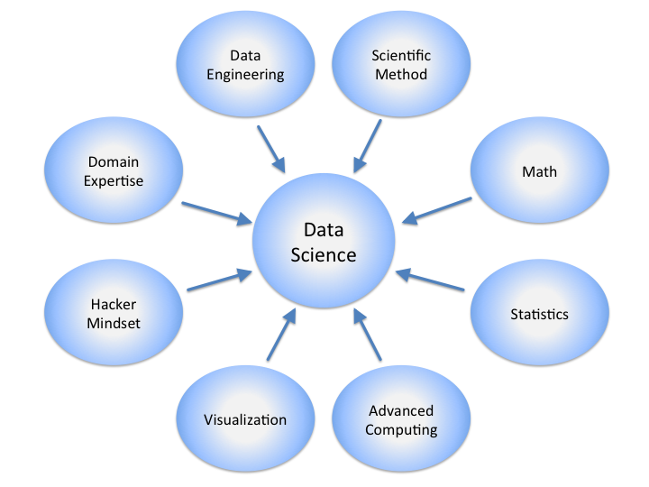
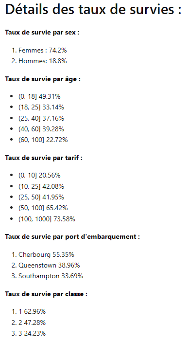
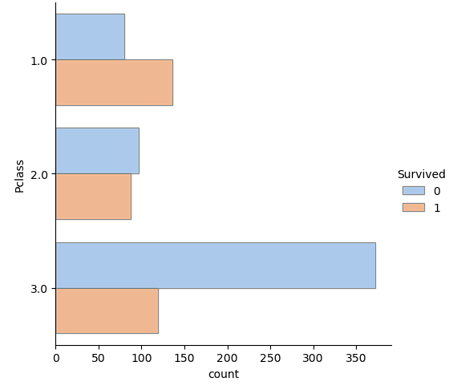
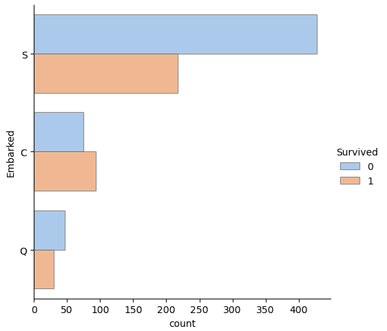
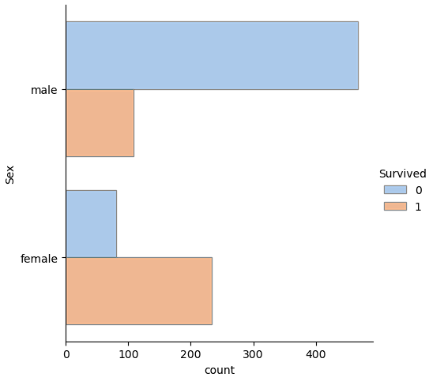

\setcounter{figure}{0}

# Quantum Support Vector Classification with the Titanic Dataset
_Adrien Veres_

_Le-Point-Technique_, _06/2024_

__abstract__: Ce travail explore l'apport de l'informatique quantique au machine learning en comparant un classifieur quantique, le QuanticSVM de la librairie pyRiemann-qiskit, à des méthodes classiques (régression linéaire, SVC, SVC à noyau RBF) sur le jeu de données Titanic. L'objectif est d'évaluer si un noyau quantique peut améliorer la prédiction du taux de survie des passagers par rapport à la méthode actuellement utilisée en production chez un client.

__keywords__: quantum machine learning, QuanticSVM, pyRiemann-qiskit, Qiskit, Titanic, SVM

## I. Introduction

### A. Un domaine en pleine évolution

La data science, ou « science des données », regroupe plusieurs disciplines : les mathématiques, les statistiques, la visualisation, le machine learning, etc. (_Figure 1_).

> 
> <pre>
> Figure 1: Les disciplines de la data science
> </pre>

Le machine learning, ou « apprentissage machine », est la discipline qui permet à l'ordinateur d'apprendre à partir d'un jeu de données, afin de faire des prédictions, établir des tendances ou même prendre des décisions en fonction de ces données.

La data science est en plein essor : de plus en plus d'entreprises y font appel, de la finance à la santé. Elle aide les gouvernements à détecter les fraudes fiscales, à gérer les risques dans les fonds d'investissement, à trouver les meilleures chances de réussite pour soigner les malades à l'hôpital, etc. On peut la mettre en place dans presque tous les secteurs, même le BTP par exemple pour prédire la consommation d'énergie à l'avance.

### B. Objectif du projet

L'objectif du projet est d'améliorer la méthode actuellement utilisée en production chez un client pour prédire le taux de survie des passagers du Titanic. Pour ce faire, nous allons explorer de nouvelles avancées, et le choix du nouvel algorithme à tester s'est porté sur le QuanticSVM.

Le SVM (Support Vector Machine) est une technique de classification largement utilisée. Dans ce travail, on s'intéresse à une version quantique du SVM. La littérature scientifique a démontré que dans certaines circonstances, les algorithmes quantiques permettent d'améliorer la performance de la classification (Liu, Arunachalam, and Temme 2021). Cependant, dans la plupart des cas, les évaluations ont été réalisées avec des données artificielles, pas réelles.

Nous allons donc essayer d'appliquer ces méthodes à un vrai jeu de données, celui du Titanic, en comparant la performance du SVR avec un noyau quantique et un noyau RBF, ainsi qu'avec une régression linéaire simple. Nous nous inspirons du travail réalisé par (Andreev et al. 2023), qui présente une classification quantique de vraies données (dans cet article, il s'agit de données encéphalographiques).

### C. Notes techniques

Dans ce travail, on utilise la librairie pyRiemann-qiskit, qui est une sur-couche autour de la librairie Qiskit, une bibliothèque quantique développée par IBM. Elle a été conçue pour être aussi proche que possible des interfaces de scikit-learn, dans l'objectif de réduire l'écart entre les algorithmes classiques et les algorithmes quantiques.

L'intérêt de la sur-couche pyRiemann-qiskit est de permettre de configurer plus facilement le classifieur. Elle permet aussi de classifier non seulement des vecteurs, mais aussi des matrices, grâce à une méthode appelée la « géométrie riemannienne » (Congedo, Barachant, and Bhatia 2017).

## II. Choix des données

### 1. Explication du choix du projet utilisé comme référence

Nous avons choisi, avec mon mentor, de reprendre notre projet Titanic dans l'objectif de potentiellement améliorer notre score SVC à noyau RBF avec le QuanticSVM de pyRiemann.

### 2. Description du jeu de données sélectionné

Le projet Titanic est à la base une compétition Kaggle, dont l'objectif est de prédire le taux de survie des passagers du naufrage à partir de plusieurs variables. Nous avons calculé l'accuracy avec la régression linéaire et le SVC, puis le score du SVC à noyau RBF.

Un premier examen des taux de survie par sexe, âge, tarif, port d'embarquement et classe est résumé en _Figure 2_.

> 
> <pre>
> Figure 2: Détails des taux de survie par sexe, âge, tarif, port d'embarquement et classe
> </pre>

On notera en particulier, sur la répartition par classe (_Figure 3_), que le taux de mortalité est beaucoup plus élevé en classe 3, qu'il y a presque autant de décès que de survivants en classe 2, et un taux de survie beaucoup plus élevé pour la classe 1.

> 
> <pre>
> Figure 3: Taux de survie par classe
> </pre>

Concernant le port d'embarquement (_Figure 4_), Southampton a eu le taux de décès le plus élevé et Cherbourg le taux de décès le plus bas ; Queenstown a eu un taux de décès élevé par rapport au nombre de passagers qui y ont embarqué.

> 
> <pre>
> Figure 4: Taux de survie par port d'embarquement
> </pre>

Enfin, concernant le genre (_Figure 5_), on constate que le taux de décès est significativement plus élevé pour les hommes que pour les femmes.

> 
> <pre>
> Figure 5: Taux de survie par genre
> </pre>

## III. Choix de l'algorithme implémenté en prototype

### A. Recherche d'un article de recherche récent

Le choix s'est porté sur les travaux de (Andreev et al. 2023) et de (Havlíček et al. 2019), qui traitent respectivement de pyRiemann-qiskit et de l'apprentissage supervisé avec des espaces de caractéristiques quantiques.

### B. Description de l'algorithme sélectionné et de ses techniques

L'informatique quantique est une technologie prometteuse pour le machine learning, qui peut être moins coûteuse et potentiellement donner de meilleurs résultats. Nous avons décidé d'utiliser Qiskit, une bibliothèque d'informatique quantique développée par IBM, et pyRiemann, qui est un cadre qui aide à analyser les signaux du cerveau en se basant sur la théorie des espaces de Riemann pour extraire des caractéristiques discriminantes à partir de ces signaux et les utiliser dans des tâches de classification.

La fusion de ces deux bibliothèques a permis la création d'un processus standardisé appelé `QuantumClassifierWithDefaultRiemannianPipeline`, qui permet de classer les ondes cérébrales en deux catégories, en combinant les avantages de l'informatique quantique avec l'analyse des signaux cérébraux pour créer un modèle de classification robuste et performant.

Concrètement, pyRiemann analyse les signaux (par exemple des électroencéphalogrammes ou des électromyogrammes) à travers plusieurs étapes : la normalisation des données, la sélection des caractéristiques pertinentes et la réduction de dimension. Qiskit est ensuite utilisé pour construire le modèle de classification : il crée des instructions pour manipuler les « qubits », les unités de base de l'ordinateur quantique, qui stockent les caractéristiques des signaux et permettent d'effectuer des calculs plus rapidement qu'un ordinateur classique. Le modèle est ensuite entraîné, puis exécuté sur un ordinateur quantique ou sur un simulateur Qiskit.

### C. Justification du choix de l'algorithme

Il semblerait que l'informatique quantique offre des avantages par rapport à l'informatique classique, notamment en termes de vitesse de calcul et de résultats. Cependant, l'efficacité dépend des données utilisées, de leur qualité et de la manière dont elles sont encodées en états quantiques. Le QuanticSVM est tout simplement un SVC avec noyau quantique.

## IV. Les méthodes utilisées dans le projet Titanic

### A. La régression linéaire

Nous avons initialement utilisé la régression linéaire, une technique d'analyse de données qui permet de prédire la valeur de données inconnues en utilisant une autre valeur de données que l'on connaît déjà. Elle établit une relation entre une variable indépendante (x) et une variable dépendante (y), en cherchant la droite qui représente le mieux cette relation. Elle est très utile pour établir des prévisions, et donc très adaptée aux prévisions de taux de survie des passagers du Titanic.

### B. Le SVR (Support Vector Regression) avec noyau RBF (Radial Basis Function)

Nous avons également utilisé le SVR, une méthode de machine learning qui, comme la régression linéaire, permet de prédire des valeurs inconnues à l'aide de valeurs connues. Cependant, au lieu de tracer une ligne droite, le SVR fonctionne en utilisant des vecteurs de support : la technique du « noyau » permet de transformer les données pour les rendre linéairement séparables et ainsi de modéliser des relations non linéaires entre les variables. Le SVR peut donc prendre en compte des relations entre x et y qui ne peuvent pas être capturées par une simple ligne droite ; c'est un modèle plus adapté lorsque les relations entre les variables sont plus complexes.

### C. Méthode

Nos données sont d'abord transformées dans un état quantique avec une `ZZFeatureMap`. Pour ce travail, le nombre de répétitions a été fixé à 2, et 1024 « shots » ont été utilisés. Un shot est le nombre de fois où le circuit quantique est exécuté pour la classification : en effet, dans un ordinateur quantique, le fait de mesurer un résultat entraîne une perte d'information, et le résultat est donc en partie « erroné ». Afin de supprimer ce biais, une manière de procéder est d'exécuter l'algorithme plusieurs fois.

Ne disposant pas d'un vrai ordinateur quantique, nous avons émulé l'ordinateur avec `QasmSimulator`, qui est à l'ordinateur quantique ce que l'assembleur est à l'ordinateur classique.

### D. Résultats

Les résultats obtenus pour chaque méthode sont résumés en _Table 1_.

> 
<pre>
> +---------------------+----------+
> | Méthode             | Résultat |
> +=====================+==========+
> | Régression linéaire | 0.8044   |
> +---------------------+----------+
> | SVC                 | 0.5977   |
> +---------------------+----------+
> | SVC avec noyau RBF  | 0.5175   |
> +---------------------+----------+
> | QuanticSVM          | 0.7707   |
> +---------------------+----------+
> 

> <pre>
> Table 1: Comparaison des scores d'accuracy obtenus par méthode
> </pre>

Nous avons commencé par la régression linéaire, qui nous a donné un score d'accuracy de 0.8044. Puis nous avons mis en place un SVC de scikit-learn, avec lequel nous avons obtenu un score de 0.5977. Après le SVC, nous avons testé un modèle SVC avec noyau RBF, avec lequel nous avons obtenu un score de 0.5175 : ce score est inférieur au SVC, on peut donc penser que les modèles linéaires marchent mieux car le problème est ici linéaire.

Enfin, nous avons testé le QuanticSVM de la librairie pyRiemann-qiskit ; cependant le temps de chargement du modèle est beaucoup plus long que le SVC. Après deux jours de chargement, nous avons obtenu un score de 0.7707. Le modèle QuanticSVM nous donne donc un score supérieur au SVC de scikit-learn, et même au modèle SVC avec noyau RBF.

## V. Conclusion

Le QuanticSVM est donc une alternative au SVC, au SVC avec noyau RBF et à la régression linéaire. Cependant, on est limité par le temps : le QuanticSVM est plus adapté aux ordinateurs quantiques, et son temps de chargement est beaucoup trop long par rapport aux autres modèles sur un PC lambda.

À l'heure actuelle, seule une poignée d'entreprises possède des ordinateurs quantiques (Google, IBM, Microsoft...). Pourtant, certaines entreprises comme IBM, avec IBM Quantum Experience, proposent l'accès à leurs ordinateurs quantiques via le cloud, et donc accessible à n'importe quelle entreprise, ou même à un usage individuel. Avec l'informatique quantique, on pourra donc réduire le temps de calcul tout en améliorant nos résultats.

## Références

Andreev, A., G. Cattan, S. Chevallier, and Q. Barthélemy. 2023. ‘pyRiemann-qiskit: A Sandbox for Quantum Classification Experiments with Riemannian Geometry’. _Research Ideas and Outcomes_ 9 (March). [https://doi.org/10.3897/rio.9.e101006](https://doi.org/10.3897/rio.9.e101006).

Congedo, M., A. Barachant, and R. Bhatia. 2017. ‘Fixed Point Algorithms for Estimating Power Means of Positive Definite Matrices’. _IEEE Transactions on Signal Processing_ 65 (9): 2211–2220. [https://doi.org/10.1109/TSP.2017.2649483](https://doi.org/10.1109/TSP.2017.2649483).

Havlíček, V., A. D. Córcoles, K. Temme, A. W. Harrow, A. Kandala, J. M. Chow, and J. M. Gambetta. 2019. ‘Supervised Learning with Quantum-Enhanced Feature Spaces’. _Nature_ 567 (7747): 209–212. [https://doi.org/10.1038/s41586-019-0980-2](https://doi.org/10.1038/s41586-019-0980-2).

Liu, Y., S. Arunachalam, and K. Temme. 2021. ‘A Rigorous and Robust Quantum Speed-up in Supervised Machine Learning’. _Nature Physics_ 17: 1013–1017.

‘Sklearn wrapper around QSVM and VQC · Issue #240 · qiskit-community/qiskit-machine-learning’. GitHub. Accessed 06/2024. [https://github.com/qiskit-community/qiskit-machine-learning/issues/240](https://github.com/qiskit-community/qiskit-machine-learning/issues/240).

‘pyRiemann/pyRiemann-qiskit: A Library for Machine Learning and Quantum Programming Based on pyRiemann and Qiskit Projects’. GitHub. Accessed 06/2024. [https://github.com/pyRiemann/pyRiemann-qiskit](https://github.com/pyRiemann/pyRiemann-qiskit).

‘Case-Based and Quantum Classification for ERP-Based Brain–Computer Interfaces’. _Brain Sciences_. Accessed 06/2024. [https://www.mdpi.com/journal/brainsci](https://www.mdpi.com/journal/brainsci).
