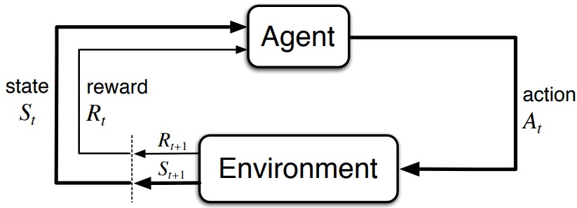
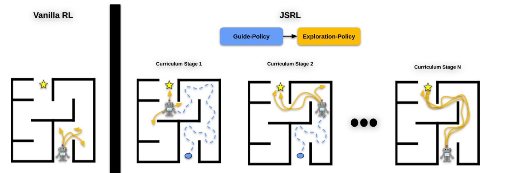
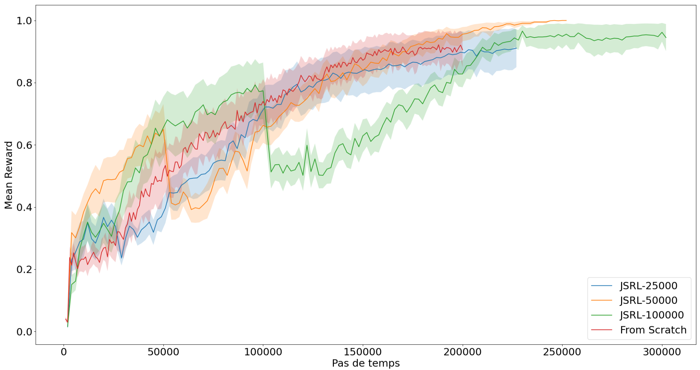
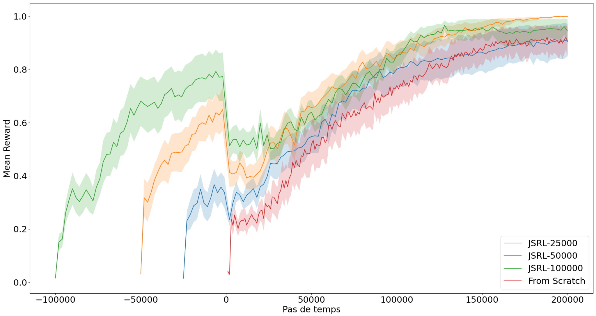
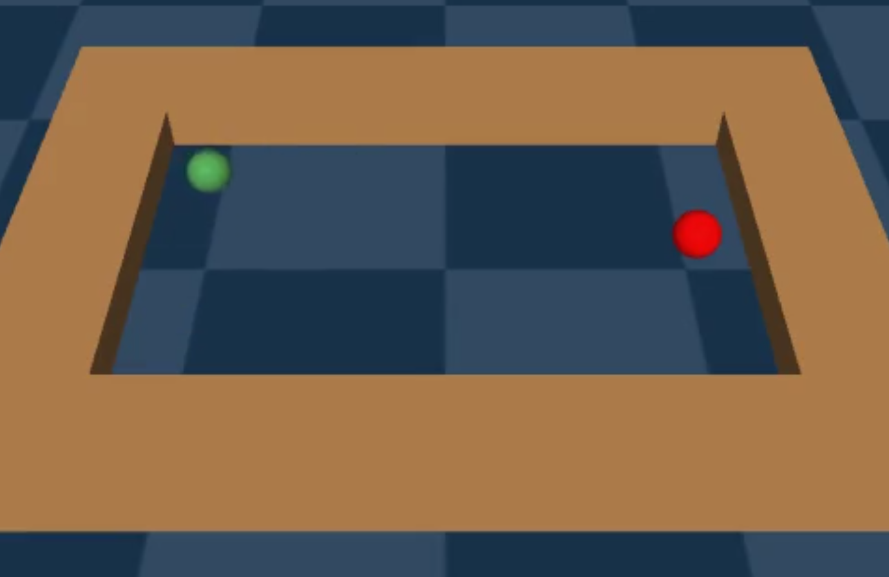

\setcounter{figure}{0}

# Jumpstart Reinforcement Learning with PPO
_Fabien Chopin_

_Le-Point-Technique_, _04/2024_

__abstract__: Ce projet étudie si la méthode Jump-Start Reinforcement Learning (JSRL), qui combine une guide-policy pré-entraînée et une exploration-policy, permet d'accélérer l'apprentissage d'un agent PPO dans un environnement complexe, en comparaison avec un entraînement classique « from scratch ». Les entraînements sont réalisés dans l'environnement Point Maze de Gymnasium, avec des durées de pré-entraînement variables.

__keywords__: Reinforcement Learning, Proximal Policy Optimization, Jump-Start Reinforcement Learning, Gymnasium, Point Maze

## 1. Introduction

### 1.1. Le Reinforcement Learning

Pour ce projet, j'ai décidé d'explorer une partie fascinante du machine learning : le Reinforcement Learning (RL). Le principe du RL est qu'un agent (un algorithme), dans un état S, va apprendre en réalisant des actions A dans un environnement et en recevant des récompenses R selon l'impact de ces actions (_Figure 1_). Ce type de méthode n'a pas besoin d'un dataset et n'a pas besoin d'être supervisée : l'agent apprend simplement à travers les récompenses qu'il obtient.

> 
> <pre>
> Figure 1: Boucle d'action entre un agent et un environnement (Sutton and Barto 2020)
> </pre>

L'objectif fondamental de l'agent dans le contexte du Reinforcement Learning est de maximiser la somme cumulative des récompenses qu'il reçoit. Une caractéristique essentielle de cette approche est que l'agent prend ses décisions en fonction de l'état actuel de l'environnement, sans nécessiter la connaissance de tous les états précédents et des actions associées.

L'information transmise à l'agent depuis l'environnement peut être complète ou partielle, tandis que les actions à disposition de l'agent peuvent être finies ou infinies. De plus, les tâches d'apprentissage de l'agent peuvent être divisées en deux catégories : épisodiques, où l'agent opère dans l'environnement entre un instant initial et un instant final, et continues, où il n'y a pas de limite de temps pour l'évolution de l'agent.

Un défi majeur du Reinforcement Learning réside dans le maintien d'un équilibre entre l'exploration de nouvelles actions et l'exploitation des connaissances déjà acquises, dans le but de maximiser les récompenses à chaque étape. Si l'agent privilégie uniquement l'exploitation des connaissances existantes, il risque de ne jamais découvrir des actions potentiellement plus bénéfiques. En revanche, en se concentrant exclusivement sur l'exploration, il peut négliger de capitaliser sur les opportunités prometteuses déjà identifiées. Trouver le juste milieu entre ces deux aspects est donc crucial pour le succès de l'agent en apprentissage par renforcement.

### 1.2. Méthodes Policy-Based versus Value-Based

L'agent réalise des actions en suivant une stratégie appelée policy : une fonction qui, pour un état d'environnement donné, décrit l'action à prendre par l'agent. L'objectif de l'entraînement en Reinforcement Learning est de trouver une policy optimale pour maximiser les récompenses obtenues par l'agent. Pour ce faire, deux approches principales sont couramment utilisées : la méthode Policy-Based et la méthode Value-Based.

La première consiste à apprendre directement la fonction policy : à chaque état de l'environnement, on associe une action, si la policy est déterministe, ou une distribution de probabilité d'actions si la policy est stochastique. La seconde consiste à apprendre une fonction qui attribue une valeur à chaque état de l'environnement, la policy consistant alors à aller vers des états d'environnement avec une valeur plus élevée que celle de l'état actuel.

La méthode Policy-Based est plus efficace dans un espace d'actions très grand, voire infini ; elle a l'avantage de pouvoir apprendre des policies stochastiques et possède de meilleures propriétés de convergence. La méthode Value-Based est plus efficace pour trouver un optimum global, elle est plus rapide et présente une variance plus faible.

### 1.3. Proximal Policy Optimization

L'entraînement d'un agent est soumis à l'aléatoire de l'environnement et de la policy si elle est stochastique. Il existe alors une forte variance dans les récompenses obtenues pour un même état initial de l'environnement. Pour réduire cette variance, on peut envisager d'augmenter fortement le nombre de pas de temps d'apprentissage, mais cela allongerait le temps d'entraînement de manière importante. La méthode Proximal Policy Optimization (PPO) permet de résoudre ce problème en alliant deux idées :

- utiliser une méthode dite Actor-Critic, qui consiste à combiner les méthodes Policy-Based et Value-Based ;
- limiter l'importance du changement de la policy entre deux mises à jour de ses poids lors de l'entraînement.

### 1.4. Problématique

La PPO permet de réduire efficacement la variance en stabilisant les entraînements, et la méthode Jump-Start Reinforcement Learning (JSRL), qui dédie une policy à l'exploitation et une à l'exploration, permet de prendre en compte le compromis mentionné précédemment. Il reste un aspect important à prendre en compte : le temps d'entraînement. Dans ce projet, je traite donc de la problématique suivante :

_La méthode JSRL permet-elle d'accélérer l'apprentissage d'un environnement complexe par un agent PPO, en utilisant un autre agent PPO pré-entraîné dans un environnement moins complexe ?_

Je vais d'abord détailler la méthode utilisée pour répondre à cette problématique, puis présenter les résultats obtenus, pour finalement en discuter et conclure.

## 2. Méthodologie

### 2.1. Jump-Start Reinforcement Learning

Le JSRL est un algorithme qui utilise deux policies : une guide-policy et une exploration-policy. La guide-policy est une policy meilleure qu'une policy aléatoire. Elle est utilisée dans les premiers pas de temps d'un épisode pour atteindre de « bons » états d'environnement, avant de laisser l'exploration-policy reprendre le contrôle. Au fur et à mesure de l'entraînement, l'exploration-policy devient de plus en plus performante : la guide-policy est donc de moins en moins utilisée, pour finalement laisser un contrôle intégral à l'exploration-policy et retourner dans un cadre de Reinforcement Learning classique (_Figure 2_).

> 
> <pre>
> Figure 2: Illustration de l'algorithme Jump-Start Reinforcement Learning (Uchendu et al. 2023)
> </pre>

Cette méthode possède trois hyperparamètres :

- le nombre initial de pas de temps utilisé par la guide-policy : `max_horizon` ;
- le nombre d'étapes de transfert progressif entre guide-policy et exploration-policy (N) ;
- le seuil bêta de performance souhaitée avant de passer de l'étape de transfert k à k+1.

Pour l'ensemble des entraînements concernés par le JSRL, j'ai fixé N=10 et max_horizon=100. Tous les 2000 pas de temps, l'agent est évalué sur 100 épisodes ; la moyenne des récompenses obtenues lors de ces 100 épisodes est conservée, et au cours de l'entraînement, le seuil bêta prend la valeur du maximum de ces moyennes.

### 2.2. Entraînements réalisés

Dans le projet, j'ai voulu répondre à la problématique dans l'environnement Point Maze Open-v3 de Gymnasium (Farama Foundation, n.d.), une API vers des environnements standards de Reinforcement Learning. J'ai choisi des épisodes d'une durée maximale de 500 pas de temps, avec un unique objectif : atteindre la cible. La récompense est de 0 si la cible n'est pas atteinte avant la fin des 500 pas de temps ; dans le cas contraire, l'épisode se termine avant les 500 pas et la récompense est de 1.

Ensuite, j'ai comparé deux types d'entraînement :

- **Un entraînement dit « from scratch »** : un entraînement classique de Reinforcement Learning pour un ensemble de 200 000 pas de temps, avec un agent PPO déterministe.
- **Un entraînement dit « JSRL-pretraining_steps »** : dans un premier temps, un agent PPO déterministe est entraîné dans l'environnement moins complexe Point Maze Open Diverse G-v3, où la position de départ est fixe (contrairement à Point Maze Open) quel que soit l'épisode, la position de la cible restant aléatoire. Ce pré-entraînement est réalisé pour un nombre prédéfini de pas de temps (`pretraining_steps`). Dans un second temps, la policy de cet agent est utilisée comme guide-policy dans un algorithme de JSRL au sein de l'environnement Point Maze Open-v3, l'exploration-policy étant utilisée par un agent PPO déterministe. Le nombre de pas de temps d'entraînement JSRL est lui aussi de 200 000. L'implémentation de cette deuxième phase utilise le dépôt GitHub de (Tang 2024).

Au total, 10 entraînements from scratch, 10 JSRL-25000, 10 JSRL-50000 et 10 JSRL-100000 sont réalisés.

## 3. Résultats

Les résultats de ces entraînements sont représentés en _Figure 3_ et _Figure 4_.

> 
> <pre>
> Figure 3: Récompenses cumulées moyennes des agents. Le pas de temps final est commun à tous.
> </pre>

> 
> <pre>
> Figure 4: Récompenses cumulées moyennes des agents. Le pas de temps initial est commun à tous.
> </pre>

Les pas de temps négatifs correspondent aux pré-entraînements dans l'environnement moins complexe. On constate qu'en moyenne, pré-entraîner pendant 50 000 ou 100 000 pas permet d'obtenir des agents plus performants qu'un entraînement from scratch à l'issue des 200 000 pas de temps. Cependant, un pré-entraînement de 25 000 pas ne semble pas suffisant pour améliorer les performances.

Les résultats présentés en _Figure 4_ montrent, à pas de temps égal, que JSRL ne permet pas d'apprendre plus rapidement qu'un entraînement from scratch, et implique même un entraînement global plus long lors de JSRL-100000.

Enfin, par souci de visibilité, les écarts types représentés de part et d'autre des moyennes ont été divisés par 4 sur les deux figures : on constate donc une grande variabilité des résultats.

## 4. Discussion

En ayant à disposition une policy pré-entraînée, JSRL semble accélérer l'apprentissage en environnement plus complexe. C'est un outil qui permet de transmettre efficacement des connaissances d'une policy à une autre. Au contraire, sans policy pré-entraînée, il ne semble pas efficace, en termes de temps, de se pré-entraîner à une tâche plus simple avant de s'entraîner à la tâche voulue : une décomposition de l'entraînement en tâche simple puis complexe n'est pas pertinente dans notre cas.

Pour des questions de temps de projet, de capacités de calcul et de simplicité de mise en place, plusieurs limitations sont à noter :

- dans l'article de recherche de référence, l'agent utilisé pour les guide- et exploration-policies était un Implicit Q-Learning et non un PPO. Bien qu'il s'agisse d'une méthode Actor-Critic, elle est utilisée avec un pré-entraînement basé sur un dataset hors-ligne (un ensemble fini d'états, d'actions et de récompenses regroupés dans un dataset, l'agent n'ayant pas d'accès direct à l'environnement) ;
- l'environnement Point Maze Open est relativement simple en comparaison des environnements présentés dans l'article de recherche : il s'agit d'un simple carré, sans obstacle, comme le montre la _Figure 5_ ;

> 
> <pre>
> Figure 5: Exemple d'état initial d'un épisode de Point Maze Open-v3
> </pre>

- finalement, aucune optimisation des hyperparamètres n'a été faite. Le `max_horizon` a été choisi proche du nombre de pas de temps moyen nécessaire à un agent entraîné from scratch pour résoudre une tâche dans Point Maze Open-v3. Le paramètre N a été arbitrairement fixé à 10 ; il pourrait avoir un impact sur la rapidité de transfert de connaissances. Enfin, le seuil de performance pourrait influencer la vitesse et la qualité de ce transfert.

## 5. Conclusion

La méthode JSRL ne semble pas accélérer un entraînement pour une toute nouvelle tâche dans un environnement, mais elle semble permettre de valoriser efficacement une policy pré-existante pour la généraliser à un environnement ou une tâche plus complexe que lors de sa création.

## Références

Sutton, R. S., and A. G. Barto. 2020. ‘Reinforcement Learning: An Introduction’. [https://web.stanford.edu/class/psych209/Readings/SuttonBartoIPRLBook2ndEd.pdf](https://web.stanford.edu/class/psych209/Readings/SuttonBartoIPRLBook2ndEd.pdf).

Uchendu, I., T. Xiao, Y. Lu, B. Zhu, M. Yan, J. Simon, M. Bennice, et al. 2023. ‘Jump-Start Reinforcement Learning’. arXiv, July 7, 2023. Accessed April 11, 2024. [http://arxiv.org/abs/2204.02372](http://arxiv.org/abs/2204.02372).

Farama Foundation. n.d. ‘Gymnasium-Robotics Documentation’. Accessed April 11, 2024. [https://robotics.farama.org/envs/maze/point_maze.html](https://robotics.farama.org/envs/maze/point_maze.html).

Tang, S. 2024. ‘jumpstart-rl’. April 10, 2024. Accessed April 11, 2024. [https://github.com/steventango/jumpstart-rl](https://github.com/steventango/jumpstart-rl).
