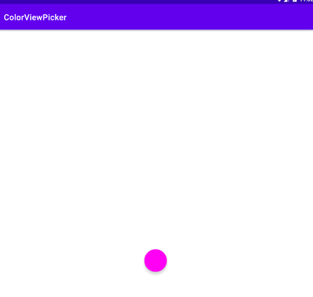
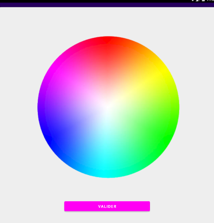

# ColorPicker: Une librairie pour choisir une couleur sous Android

_Amelin, Lucas_; 
_Abdelouahad, Mustapha_ 

_Le-Point-Technique_, _March/2022_

__abstract__: Présentation d'une librairie pour choisir une couleur sous Android. La librairie s'installe facilement avec Jetpack, et permet d'intégrer un bouton dit `flottant` au layout de l'application. Un clic sur ce bouton permet d'ouvrir une fenêtre de sélection sous la forme d'un disque colore. L'utilisateur peut alors sélectionner la couleur de son choix en cliquant sur un endroit du disque.

__keywords__: Android, Jetpack, library, color picker

## Introduction

ColorPicker est une [librairie Android](https://github.com/LucasGitHubz/ColorPicker) qui permet de choisir a un utilisateur de choisir une couleur sur un disque colore. La librairie s'intègre sous la forme d'un bouton dit `flottant` au layout de l'application (_Figure 1_).

> 
>
> _Figure 1: La librairie se présente sous la forme d’un bouton a intégrer a l’application_

Un clic sur ce bouton permet d'ouvrir une interface de sélection sous la forme d'un disque colore (_Figure 2_).

> 
>
> _Figure 2: Visualisation de l’interface permettant de sélectionner une couleur_

L'utilisateur clic sur un endroit du disque pour choisir la couleur. La couleur du bouton `valider` en bas de l'écran est alors mise à jour en fonction de la couleur sélectionnée. Le clic sur le bouton` valider` permet de sélectionner la couleur.

## Procédure Installation
1. Dans `app/build.gradle` ajouter la dépendance suivante : _implementation 'com.github.LucasGitHubz:ColorPicker:_`Release Number`'
   Où `Release Number` correspond à une des versions sur [cette](https://github.com/LucasGitHubz/ColorPicker/releases) page.
3. A la racine du projet dans le fichier `settings.gradle` ajouter dans `repositories {...}` : _maven { url 'https://jitpack.io' }_

## Procédure D'utilisation
Dans votre layout ajouter le bouton : 

```
 <com.lucasgithubz.colorpicker.FloatingButton
        android:id="@+id/colorPickerButton"
        android:layout_width="wrap_content"
        android:layout_height="wrap_content"/>
```

Du côté code, utiliser ensuite la fonctionnalité de _view binding_ ou butterknife pour récupérer le bouton `flottant` grâce à son id.
Les methodes `getColor` et `setColor(int)` permettront respectivement de recuperer et programmer la couleur du bouton.

## References
[ColorPicker](https://github.com/LucasGitHubz/ColorPicker)


