# Intégration continue avec GitLab
_Nicolas, BERTRAND_

_Le-Point-Technique_, _January/2022_

__abstract__: GitLab est une plateforme de développement open source dédiée à la gestion de projet informatique. De la gestion de version du code source, en passant par son tableau de bord qui permet de suivre les tâches en cours ou encore par la définition précise des rôles de chaque membre de l'équipe, GitLab offre un grand nombre de fonctionnalités qui facilitent le travail collaboratif. Dans ce tutoriel, je vais tenter d'expliquer quelques notions techniques et fournir des extraits de code en me concentrant sur l'aspect intégration continue. Pour ce faire, je vais utiliser la plateforme DevOps accessible en ligne à l'adresse [About GitLab](https://about.gitlab.com). L'objectif est de créer un pipeline d'intégration continue contenant six étapes d'automatisation, à savoir, l'étape de compilation, des tests unitaires, de la couverture du code par les tests, de la qualité du code, de la création de package pour terminer avec la création d'image pour conteneuriser nos applications.

__keywords__: pipeline CI, intégration continue, GitLab, GitLab Runner, build, unit test, code coverage, code quality, Spring, Maven, Docker, Kaniko

## Introduction
Afin de garantir une certaine compréhension, je vais commencer par décrire quelques concepts, en fournissant la définition des mots clés utilisés sur la plateforme GitLab. Je vais poursuivre avec un mot sur l'installation de l'outil et sur la création d'un nouveau projet. Enfin, je vais expliquer comment mettre en place le pipeline en fournissant d'abord un exemple basique, puis des exemples plus complets de manière à créer notre pipeline d'intégration continue.

## Concepts clés
Dans cette partie, je vais définir le vocabulaire employé pour ce tutoriel d'un point de vue utilisateur de la solution GitLab.

### Intégration continue
L'intégration continue est une pratique qui consiste à mettre en place un ensemble de vérifications qui se déclenchent automatiquement lorsque les développeurs envoient les modifications apportées au code source, lui même stocké dans un dépôt Git, dans notre cas sur un serveur GitLab. L'exécution de scripts automatiques permet de réduire le risque d'introduction de nouveaux bugs dans l'application et de garantir que les modifications passent tous les tests et respectent les différentes normes qualitatives exigées pour un projet.

### Job
Un _job_ est une tâche regroupant un ensemble de commandes à exécuter.

### Job Artifacts
L'exécution d'un job peut produire une archive, un fichier, un répertoire. Ce sont des artefacts que l'on peut télécharger ou visualiser en utilisant l'interface utilisateur de GitLab.

### Pipeline
Représente le composant de plus haut niveau. Il est composé de jobs (tâches), qui définissent ce qu'il faut faire, et de _stages_ (étapes) qui définissent quand les tâches qui donnent le timing d'exécution des dites tâches. Dans notre cas, les six stages que nous allons mettre en place sont 'build', 'unit-test', 'coverage', 'quality', 'package' et 'docker'.

### GitLab Runners
GitLab Runner est une application qui prend en charge l'exécution automatique des builds, tests et différents scripts avant d'intégrer le code source au dépôt et d'envoyer les rapports d'exécutions à GitLab. Ce sont des processus qui récupèrent et exécutent les jobs des pipelines pour GitLab. Il existe deux types de runner, les _shared runners_, qui sont mis à notre disposition à travers la plateforme et les _specific runners_ qui sont spécifiques à un projet et peuvent être installés sur nos machines.

### GitLab Server
Le serveur GitLab est un serveur web qui fournit à l'utilisateur des informations sur les dépôts git hébergés dans son espace. Il a essentiellement deux fonctions. Il contient le dépôt git et il contrôle les runners.

## Installation
Je ne vais pas expliquer comment installer GitLab dans cette présentation car vous trouverez toutes les informations nécessaires sur ce sujet dans la documentation officielle (voir [Install GitLab](https://docs.gitlab.com/ee/install/)). De plus, une inscription à l'offre gratuite de GitLab permet de profiter des fonctionnalités de la solution SaaS sans configuration technique ni téléchargement ou installation. Cela dit, il est important de préciser que tous les nouveaux inscrits, à compter du 17 Mai 2021 doivent fournir une carte de paiement valide afin d'utiliser les shared runners de GitLab.com (voir [How to prevent crypto mining abuse on GitLab.com SaaS](https://about.gitlab.com/blog/2021/05/17/prevent-crypto-mining-abuse/)). L'objectif de cette décision est de mettre fin aux consommations abusives des minutes gratuites de pipeline offertes par GitLab pour miner des crypto-monnaies. Si vous ne pouvez pas fournir ces informations, vous avez la possibilité d'installer un runner sur votre machine (voir [Install GitLab Runner](https://docs.gitlab.com/runner/install/)). Dans le paragraphe suivant je vais vous montrer comment installer, paramétrer et utiliser un runner spécifique.

### Specific Runners
Par défaut, le pipeline de GitLab utilise les shared runners pour exécuter les jobs. Vous trouverez ces informations en naviguant dans le menu _Settings_ de votre projet, puis _CI/CD_, et enfin _Runners_ (voir _Figure 1_ ci-dessous).

> 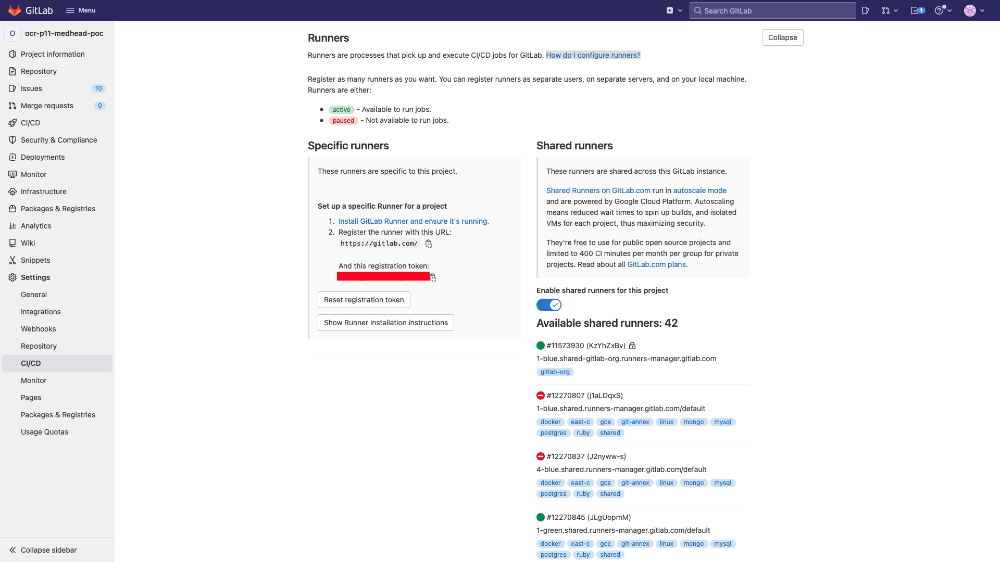
>
> _Figure 1: Les runners du projet_

À gauche, nous pouvons voir la colonne _Specific runners_, dans laquelle nous trouvons des liens vers la procédure d'installation suivant différents environnements (voir _Figure 2_ ci-dessous).

> 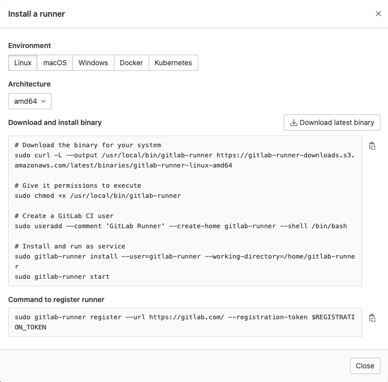
>
> _Figure 2: Installer un runner spécifique_

Une fois installé en local, nous devons enregistrer le runner pour notre projet (voir [Registering runners](https://docs.gitlab.com/runner/register/index.html#example)). Nous pouvons réaliser cette tâche en mode interactif ou one-line. Voici les différentes étapes communes à tous les environnements en mode interactif :

1. Exécutez la commande (suivant votre os, voir la [doc](https://docs.gitlab.com/runner/register/index.html#example)) : sudo gitlab-runner register
2. Entrez l'URL de l'instance GitLab (voir colonne Specific runners) : https://gitlab.com/
3. Entrez le jeton fourni pour enregistrer le runner (voir colonne Specific runners) : uytryuBN76545fgcv
4. Entrez une description pour votre runner : myLocalRunner
5. Entrez un ou plusieurs tags pour votre runner
6. Entrez le runner executor : docker
7. Si vous avez entré docker à l'étape précédente une image par défaut doit être spécifiée : maven:latest

Après avoir désactivé l'option shared runners de la page de configuration des runners de notre projet nous devrions voir le runner spécifique de notre machine disponible et actif pour exécuter les jobs de notre pipeline (voir _Figure 3_ ci-dessous).

> 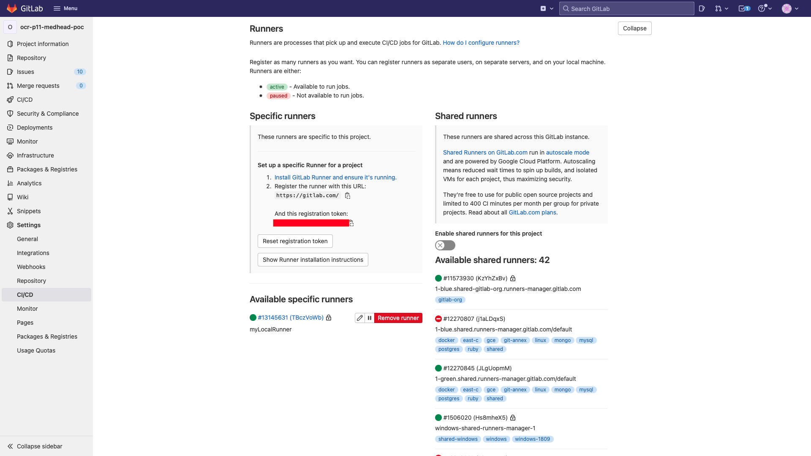
>
> _Figure 3: Notre runner spécifique est disponible_

L'action d'enregistrer un runner spécifique pour notre projet crée un fichier de configuration local appelé _config.toml_ sur notre machine (dans le répertoire /etc/gitlab-runner pour un environnement linux). C'est dans ce fichier que l'on retrouve les informations transmises lors de l'enregistrement de notre runner. Vous trouverez ci-dessous le fichier config.toml de ma configuration qui contient un peu plus d'option que celles générées par défaut, en particulier pour le paramètre volumes des options runners.docker. Je vous laisse découvrir la documentation [Configuring GitLab Runner](https://docs.gitlab.com/runner/configuration/) et [GitLab Runner commands](https://docs.gitlab.com/runner/commands/) pour approfondir les informations délivrées dans cette parenthèse.

```
concurrent = 1
check_interval = 0

[session_server]
  session_timeout = 1800

[[runners]]
  name = "myLocalRunner"
  url = "https://gitlab.com/"
  token = "uytryuBN76545fgcv"
  executor = "docker"
  builds_dir = "/tmp/builds"
  [runners.custom_build_dir]
  [runners.cache]
    [runners.cache.s3]
    [runners.cache.gcs]
    [runners.cache.azure]
  [runners.docker]
    tls_verify = false
    image = "maven:latest"
    privileged = false
    disable_entrypoint_overwrite = false
    oom_kill_disable = false
    disable_cache = false
    volumes = ["/cache", "/var/run/docker.sock:/var/run/docker.sock", "/tmp/builds:/tmp/builds"]
    shm_size = 0
```

## Création d'un nouveau projet
Une fois les étapes d'inscription et d'installation franchies, nous pouvons créer un nouveau projet (voir _Figure 4_ ci-dessous). Remplissez les champs avec les informations de votre choix.

> 
>
> _Figure 4: Page de création d'un nouveau projet_

GitLab crée un repository vide  (voir _Figure 5_ ci-dessous) et nous indique les commandes git à exécuter  (voir _Figure 6_ ci-dessous) afin de poursuivre la création du projet.

> 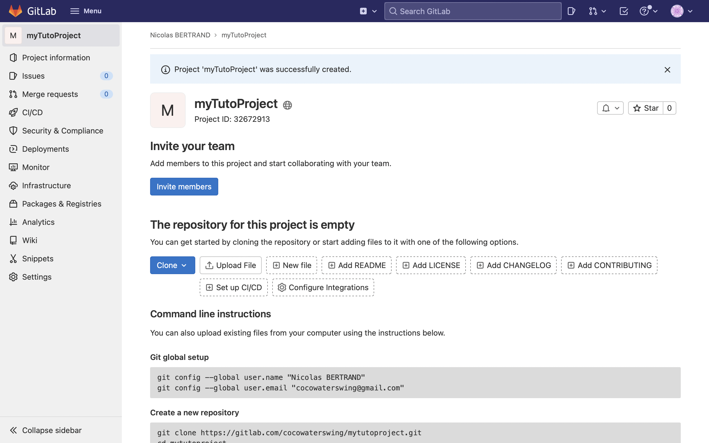
>
> _Figure 5: Page d'accueil du nouveau projet vide'_

> 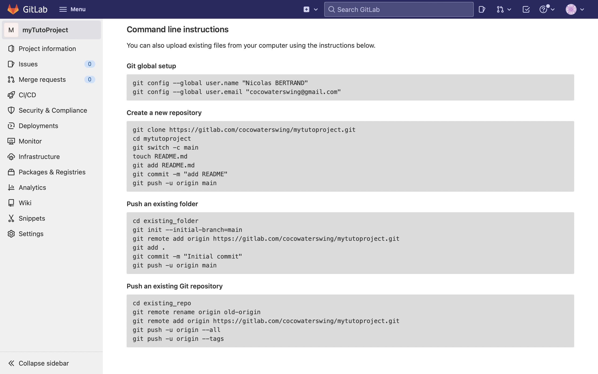
>
> _Figure 6: Commandes git à exécuter_

## Création du pipeline
Nous allons maintenant construire le pipeline et mettre en place les différents jobs. Pour continuer cette présentation, je vais utiliser le projet accessible à cette adresse [MedHead](https://gitlab.com/cocowaterswing/ocr-p11-medhead-poc) (voir _Figure 7_ ci-dessous). Tous les extraits de code et figures qui vont suivre sont tirés de ce projet, réalisé dans le cadre d'une formation qualifiante de la plateforme [OpenClassrooms](https://openclassrooms.com/fr/). Il s'agit de plusieurs applications Spring Boot, qui utilisent l'outil Maven et le langage Java.

> 
>
> _Figure 7: Repository du projet MedHead_

### .gitlab-ci.yml, exemple simple
Afin de paramétrer un pipeline sur la plateforme GitLab, nous devons commencer par créer un fichier .gitlab-ci.yml à la racine de notre repository. Ce fichier est organisé autour de deux notions importantes, les _stages_ et les jobs. Les stages indiquent le nom et l'ordre d'exécution des jobs, qui sont eux-mêmes attachés à un stage. L'extrait de code ci-dessous montre une écriture minimale du fichier.

```yml
stages:
  - build
  - test

build-job:
    stage: build
    script:
        - echo "Le projet build..."

test-job:
    stage: test
    script:
        - echo "Les tests s'exécutent..."

```

Maintenant que le fichier est créé nous pouvons effectuer un commit, cette action va démarrer l'exécution automatique du pipeline, que nous pouvons suivre dans l'onglet _Pipelines_ de l'interface (voir _Figure 8_ ci-dessous). Le pipeline peut avoir différents états, _running_ quand il est en cours d'exécution puis, _passed_ ou _failed_, qui indiquent respectivement que l'exécution s'est déroulée correctement ou, au contraire, qu'elle est stoppée car des erreurs ont été trouvées.

> 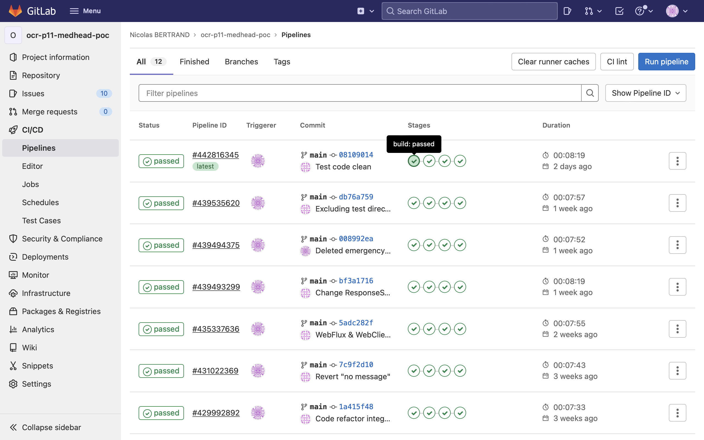
>
> _Figure 8: Exécution du pipeline_

### .gitlab-ci.yml, build et tests unitaires

Voyons maintenant un extrait du code permettant de compiler puis d'exécuter les tests de l'application _emergency_ du projet MedHead.

```yml
image: maven:latest # J'ajoute l'image docker que le runner va utiliser pour exécuter mes scripts

stages:
  - build
  - unit-test

build-ms-emergency:
  stage: build
  script:
    - cd emergency
    - ./mvnw compile # Commande maven pour compiler le code source du projet

unit-test-ms-emergency:
  stage: unit-test
  script:
    - cd emergency
    - ./mvnw surefire-report:report # Crée un rapport d'exécution des tests au format html
  artifacts:
    when: always
    # paths permet de sauvegarder les artefacts générés pendant l'exécution du script sur le GitLab Server
    # et de les retrouver dans l'onglet browse du job ou le bouton download du pipeline
    paths:
      - emergency/target/site/surefire-report.html
    # reports:junit permet de récupérer les artefacts TEST-com.ocr.medhead.emergency.*.xml
    #afin d'intégrer les rapports dans l'onglet test des détails d'un job
    reports:
      junit:
        - emergency/target/surefire-reports/TEST-*.xml

```

Dans cet extrait de code, le mot clé _image_ indique quelle image docker doit être employée par le _runner_ pour exécuter les jobs.

Une fois le job _build-ms-emergency_ traité par le pipeline, nous pouvons visualiser le résultat du build en naviguant dans l'onglet _Jobs_ et en le sélectionnant dans la liste (voir _Figure 9_ ci-dessous).

> 
>
> _Figure 9: Visualisation du résultat du build_

Le pipeline poursuit son exécution avec le job nommé _unit-test-ms-emergency_. Ce job va nous permettre d'exécuter les tests unitaires développés pour l'application _emergency_. En complément, nous allons générer un rapport que nous pourrons sauvegarder grâce à l'utilisation du mot clé _artifacts_. Nous spécifierons la fréquence de création de ce rapport avec _when_ et le sauvegarderons, dans un format html avec _paths_ pour le consulter ou le télécharger ultérieurement (voir _Figure 10_ ci-dessous), ainsi que dans un format xml avec _reports:junit_ pour qu'il soit intégré dans l'interface utilisateur de GitLab (voir _Figure 11_ ci-dessous).

> 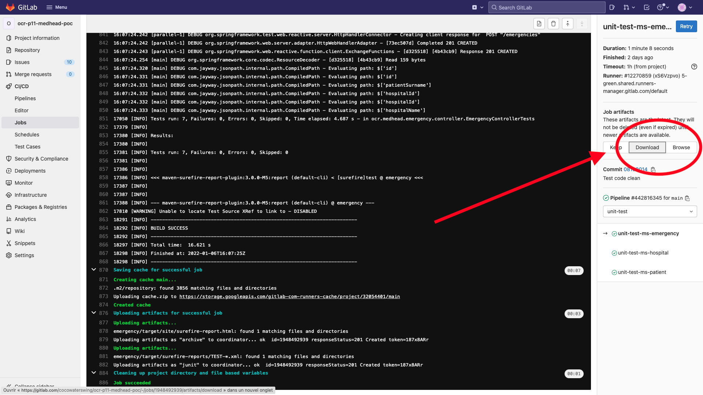
>
> _Figure 10: Télécharger ou visualiser un rapport d'exécution des tests unitaires_

> 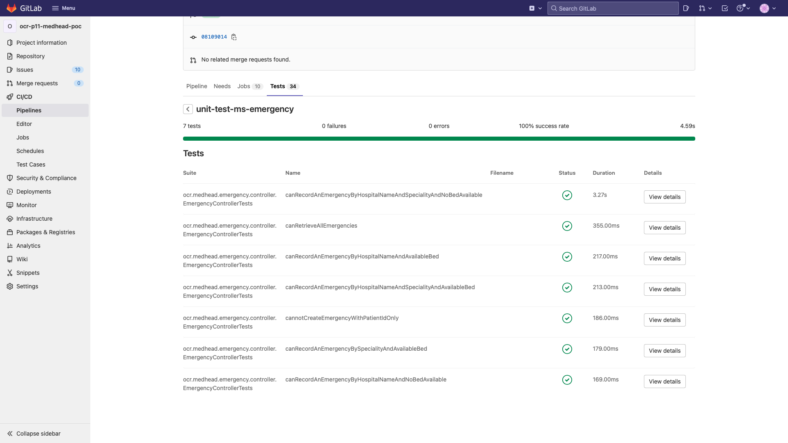
>
> _Figure 11: Intégration du rapport d'exécution des tests unitaires dans GitLab_

### .gitlab-ci.yml, Code Coverage

Dans l'extrait de code suivant, j'ai ajouté le stage _coverage_ et le job _coverage-ms-emergency_. Cela va nous permettre de générer automatiquement un rapport de couverture du code par les tests. Comme pour le job précédent celui-ci est généré puis sauvegardé afin d'être consulté ou téléchargé ultérieurement (voir _Figure 12_ ci-dessous). L'intégration des résultats du rapport dans l'interface GitLab n'est pas abordée dans ce tutoriel. Si vous le souhaitez vous trouverez les informations nécessaires pour activer cette visualisation à cette adresse [Test coverage visualization](https://docs.gitlab.com/ee/user/project/merge_requests/test_coverage_visualization.html#maven-example).

```yml
image: maven:latest

stages:
  - build
  - unit-test
  - coverage

build-ms-emergency:
  ...

unit-test-ms-emergency:
  ...

coverage-ms-emergency:
  stage: coverage
  script:
    - cd emergency
    # Le plugin JaCoCo (Java Code Coverage) génère un rapport de couverture du code source par les tests
    - ./mvnw jacoco:report
  artifacts:
    when: always
    # paths permet de sauvegarder les artefacts générés pendant l'exécution du script sur le GitLab Server
    # et de les retrouver dans l'onglet browse du job ou download du pipeline
    paths:
      - emergency/target/site/jacoco/
```

> 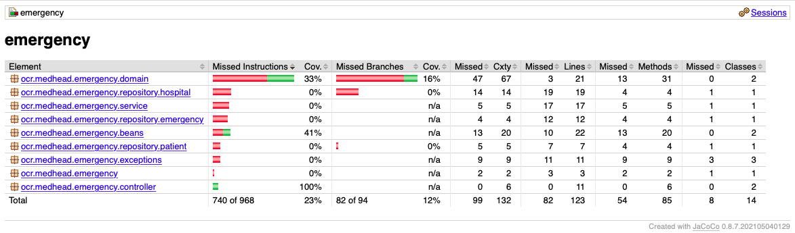
>
> _Figure 12: Rapport html généré par JaCoCo_

### .gitlab-ci.yml, Code Quality

Dans ce paragraphe, je vais décrire le stage _quality_ de notre pipeline d'intégration continue.
Pour l'exécution du job _code_quality_job_ nous allons utiliser une _image_ docker, différente de l'image maven utilisée jusqu'à maintenant.
Une chose intéressante à remarquer est le mot clé _services_ qui spécifie _docker:stable-dind_. Le _dind_ signifie Docker in Docker et veut dire que le runner va utiliser Docker comme _executor_, pour exécuter les scripts, et que le script utilise lui même une image Docker de Code Climate afin de créer un rapport sur la qualité du code source. Nous ajoutons le plugin _SonarJava_, un analyseur de code qui nous permet de détecter les code smells, bugs et failles de sécurité. Pour activer ce plugin nous créons un fichier nommé _.codeclimate.yml_ à la racine du projet. Ce fichier nous permet non seulement d'activer le plugin mais aussi d'exclure les répertoires _mvn_, _test_ et _target_ de l'analyse.
Une fois terminé, comme pour les autres jobs, un artefact est créé et peut être téléchargé ou visualisé dans un navigateur (voir _Figure 13_ ci-dessous).

> _.gitlab-ci.yml_
```yml
image: maven:latest

stages:
  - build
  - unit-test
  - coverage
  - quality

build-ms-emergency:
  ...

unit-test-ms-emergency:
  ...

coverage-ms-emergency:
  ...

code_quality_job:
  stage: quality
  image: docker:stable
  services:
    - docker:stable-dind
  script:
    - mkdir codequality-results
    - docker run
      --env CODECLIMATE_CODE="$PWD"
      --volume "$PWD":/code
      --volume /var/run/docker.sock:/var/run/docker.sock
      --volume /tmp/cc:/tmp/cc
      codeclimate/codeclimate analyze -f html > ./codequality-results/index.html
  artifacts:
    paths:
      - codequality-results/

```

> _.codeclimate.yml_
```yml
plugins:
  sonar-java:
    enabled: true
    config:
      sonar.java.source: "17"
exclude_patterns:
  - "**/.mvn/"
  - "**/target/"
  - "**/test/"
```

> 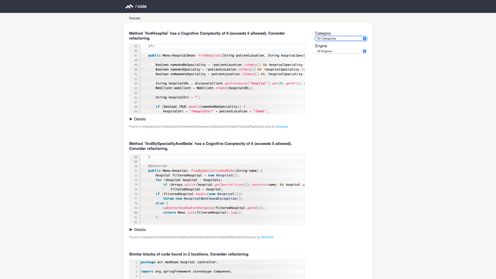
>
> _Figure 13: Rapport HTML généré par Code Climate_

### .gitlab-ci.yml, Package

Cette nouvelle étape est celle dans laquelle nous allons créer des packages pour notre application et les stocker dans le _Package Registry_ de GitLab. Le but de ce processus est de préparer le travail de déploiement de la phase de livraison continue en sauvegardant nos artefacts. Pour cela nous ajoutons un nouveau stage, _package_ et un job _package-ms-emergency_. Dans la partie script du job, j'utilise le plugin deploy de Maven pour ajouter les différents artefacts au package registry. Deploy représente la dernière phase du cycle de vie par defaut de la création d'une application avec Maven. Une fois le job achevé nous retrouvons les Fat JAR de nos applications contenant toutes nos classes, ressources et dépendances dans le menu Package Registry (voir _Figure 14_ ci-dessous). Nous pouvons aussi accéder à notre application via l'onglet download ou browse du job, comme pour les rapports.

```yml
image: maven:latest

stages:
  - build
  - unit-test
  - coverage
  - quality
  - package

build-ms-emergency:
  ...

unit-test-ms-emergency:
  ...

coverage-ms-emergency:
  ...

code_quality_job:
  ...

package-ms-emergency:
  stage: package
  script:
    - cd emergency
    - 'mvn deploy -s ci_settings.xml'
  artifacts:
    when: always
    paths:
      - emergency/target/*.jar
```

> 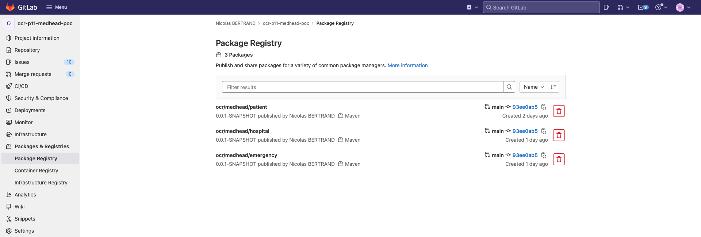
>
> _Figure 14: Visualisation du Package Registry de GitLab_

### .gitlab-ci.yml, Docker

L’ultime étape de notre pipeline d’intégration continue, repose sur la création d’image docker que nous stockons dans le _Container Registry_ de GitLab. L’objectif de ce processus est de faciliter le travail de déploiement de la phase de livraison continue. Pour cela nous ajoutons un nouveau stage, _docker_ et un job _dockerize-ms-emergency_. J'utilise _Kaniko_, un outil de création d'image docker qui n'a pas besoin d'accès privilégiés sur la machine hôte et nous évite des problèmes de sécurité. Une fois le job achevé nous retrouvons les images de nos applications dans le menu Container Registry (voir _Figure 15_ ci-dessous). Désormais, nous pouvons utiliser ces images pour la création de nos conteneurs.

```yml
image: maven:latest

stages:
  - build
  - unit-test
  - coverage
  - quality
  - package
  - docker

build-ms-emergency:
  ...

unit-test-ms-emergency:
  ...

coverage-ms-emergency:
  ...

code_quality_job:
  ...

package-ms-emergency:
  ...

dockerize-ms-emergency:
  stage: docker
  image:
    name: gcr.io/kaniko-project/executor:debug
    entrypoint: [""]
  script:
    - mkdir -p /kaniko/.docker
    - echo "{\"auths\":{\"${CI_REGISTRY}\":{\"auth\":\"$(printf "%s:%s" "${CI_REGISTRY_USER}" "${CI_REGISTRY_PASSWORD}" | base64 | tr -d '\n')\"}}}" > /kaniko/.docker/config.json
    - >-
      /kaniko/executor
      --context "${CI_PROJECT_DIR}"
      --dockerfile "${CI_PROJECT_DIR}/emergency/Dockerfile"
      --destination "${CI_REGISTRY_IMAGE}/emergency:${CI_COMMIT_TAG}"
```

> 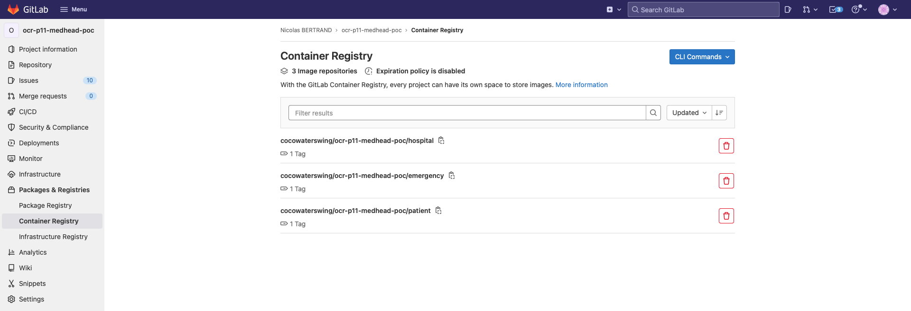
>
> _Figure 15: Visualisation du Container Registry de GitLab_

## Conclusion
Dans cette présentation, nous avons vu comment construire un pipeline d'intégration continue avec GitLab. Les différentes étapes du pipeline nous permettent dorénavant de récupérer des rapports sur l'exécution des tests unitaires, sur la couverture du code par les tests, sur la qualité du code source de notre projet et finalement, non seulement créer, mais aussi conteneuriser nos applications. Cette configuration peut évidemment être améliorée. Elle constitue une base de travail à laquelle nous pouvons par exemple ajouter des tests d'intégration mais aussi une étape de vérification des vulnérabilités de nos conteneurs pour ensuite compléter d'autres aspects DevOps, comme la mise en production automatisée de nos applications.

## Références

### Liens présents dans la documentation
[About GitLab](https://about.gitlab.com) <br/>
[How to prevent crypto mining abuse on GitLab.com SaaS](https://about.gitlab.com/blog/2021/05/17/prevent-crypto-mining-abuse/) <br/>
[Install GitLab](https://docs.gitlab.com/ee/install/)
[Install GitLab Runner](https://docs.gitlab.com/runner/install/) <br/>
[Registering runners](https://docs.gitlab.com/runner/register/index.html#example) <br/>
[Configuring GitLab Runner](https://docs.gitlab.com/runner/configuration/) <br/>
[GitLab Runner commands](https://docs.gitlab.com/runner/commands/) <br/>
[Maven](https://maven.apache.org/guides/introduction/introduction-to-the-lifecycle.html) <br/>
[MedHead](https://gitlab.com/cocowaterswing/ocr-p11-medhead-poc) <br/>
[OpenClassrooms](https://openclassrooms.com/fr/) <br/>
[Test coverage visualization](https://docs.gitlab.com/ee/user/project/merge_requests/test_coverage_visualization.html#maven-example) <br/>

### Liens attachés à un paragraphe du document
[Introduction | GitLab](https://docs.gitlab.com/ee/ci/quick_start/) <br/>
[Job Artifacts | GitLab](https://docs.gitlab.com/ee/ci/pipelines/job_artifacts.html) <br/>
[Création du pipeline | GitLab](https://docs.gitlab.com/ee/ci/yaml/gitlab_ci_yaml.html) <br/>
[Build et tests unitaires | Maven](https://maven.apache.org/surefire/maven-surefire-report-plugin/report-mojo.html) <br/>
[Code Coverage | Jacoco | ](https://www.jacoco.org/jacoco/trunk/doc/maven.html) <br/>
[Code Quality | Code Climate](https://docs.gitlab.com/ee/user/project/merge_requests/code_quality.html) <br/>
[Code Quality | Sonar Java](https://docs.codeclimate.com/docs/sonar-java) <br/>
[Code Quality | Docker in Docker](https://docs.gitlab.com/ee/ci/docker/using_docker_build.html#use-the-docker-executor-with-the-docker-image-docker-in-docker) <br/>
[Package | Maven GitLab](https://docs.gitlab.com/ee/user/packages/maven_repository/#create-maven-packages-with-gitlab-cicd-by-using-maven) <br/>
[Package | Maven Deploy](https://maven.apache.org/plugins/maven-deploy-plugin/) <br/>
[Docker | Kaniko](https://docs.gitlab.com/ee/ci/docker/using_kaniko.html) <br/>

### Vidéos
[GitLab CI pipeline tutorial for beginners](https://www.youtube.com/watch?v=Jav4vbUrqII) <br/>
[1. Switzerland GitLab meetup: First time GitLab & CI/CD workshop with Michael Friedrich](https://www.youtube.com/watch?v=kTNfi5z6Uvk&t=553s) <br/>
[GitLab Virtual Meetup - Intro to GitLab CI featuring Michael Friedrich](https://www.youtube.com/watch?v=l5705U8s_nQ&t=358s) <br/>
[Getting started with GitLab CI/CD](https://www.youtube.com/watch?v=sIegJaLy2ug) <br/>
[GitLab Code Quality: Speed Run](https://www.youtube.com/watch?v=B32LxtJKo9M&t=95s) <br/>
[Philippe Charrière - Se former "en douceur" à GitLab, GitLab CI & CD avec OpenFaas](https://www.youtube.com/watch?v=xQOcv_Xg-BY)
