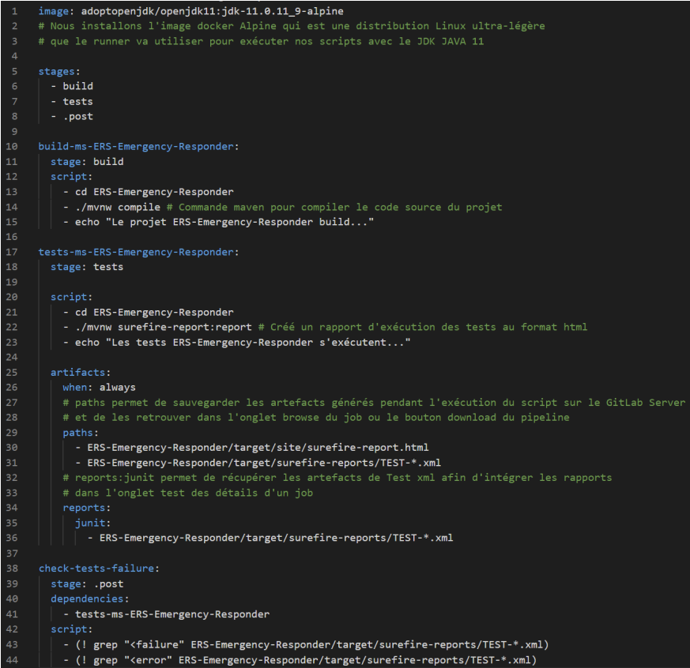
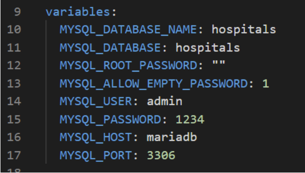
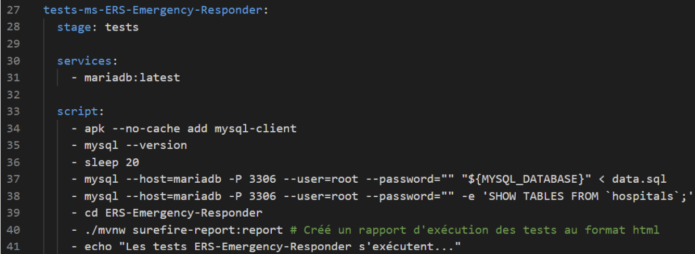
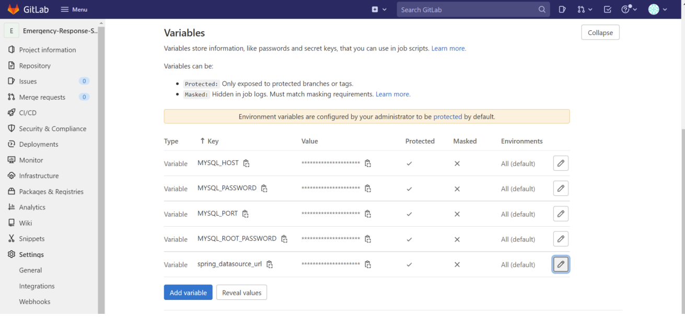
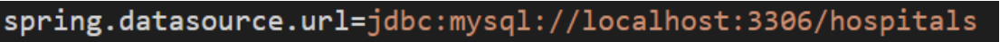
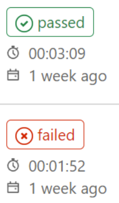
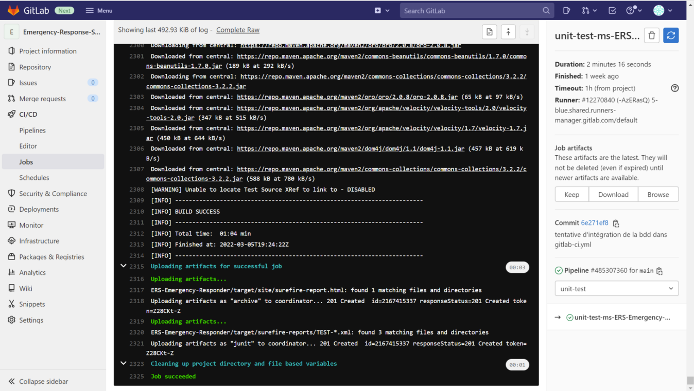
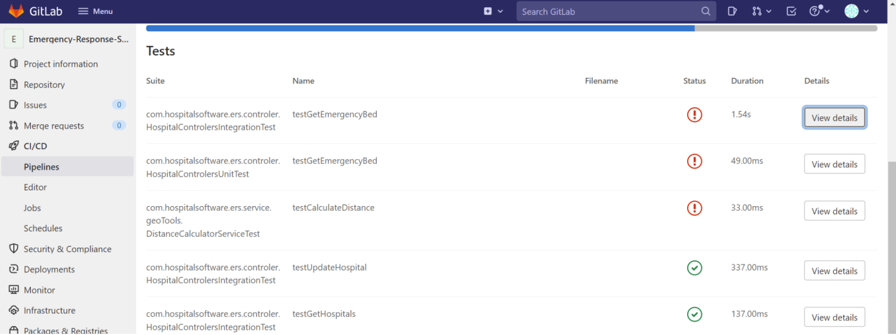

# GitLab Action with MySQL on a Java Spring Application

_Cansell, Maxime_
_Le-Point-Technique_, _March/2022_

__abstract__: Ce document présente la configuration d'une action GitLab avec une base de données MySQL dans 
un environement Java Spring.

__keywords__: GitLab, DevOps, MySQL, Java, Spring

## Introduction 
Ce document décrit les étapes de configuration d'une action GitLab avec une base de données MySQL dans une application
Java utilisant le framework Spring. Il s'inspire en partie du tutoriel [DevOps with GitLab](https://github.com/gcattan/Le-Point-Technique/blob/master/March2022/DevOps%20with%20GitLab/DevOps%20with%20GitLab.md).
Ce document comprend deux sections: création du pipeline CI et conclusion.
La création du pipeline CI contient cinq sous-sections : configuration du pipeline, Instanciation du service MySQL, enregistrement des variables d'environnement
avec GitLab, exécution de la pipeline et présentation des artifacts de builds. 

## Création du pipeline CI
Dans cette section, nous décrivons les différentes étapes de la configuration du
fichier .gitlab-ci.yml, configuration centrale de notre pipeline. Nous verrons ensuite
comment se déroulent les tests, les rapports associés et comment déboguer notre
pipeline jusqu’à son fonctionnement.

### Configuration
Afin de paramétrer notre pipeline, nous devons commencer par créer un fichier,
nommé _.gitlab-ci.yml_, à la racine de notre repository. Ce fichier est composé de l’extrait
de code visible _Figure 1_. Nous allons décrire sa composition pour chaque élément
de code dans les sous-sections suivantes. Plus tard nous rajouterons le code qui
concerne la configuration de l’image de la base de données MySQL.

A chaque push du code source des applications ou du fichier .gitlab-ci.yml sur le repository, le code de ce fichier .gitlab-ci.yml sera exécuté automatiquement.

> 
>
> _Figure 1: Example d'action gitlab._

Prenons le temps d'analyser cette example ligne par ligne:

- `image` (ligne 1) :
Nous installons l'image docker Alpine qui est une distribution Linux ultra-légère que
notre pipeline va utiliser pour exécuter nos scripts. Nous y intégrons le JDK JAVA 11.

- `stages` (ligne 5) :
Nous décrivons ici de quoi sera composée notre pipeline ; trois stage, un nommé
build qui testera que le build de l’application fonctionne normalement et un nommé tests
qui réalisera les tests unitaires et d’intégration. Le troisième stage sera chargé de vérifier si
les tests ont réussis ou échoués. Ces trois étapes sont totalement indépendantes. En effet,
chaque stage se déroule un après l’autre et crée son conteneur docker. La base de
données MySQL sera installée dans le conteneur du stage “tests” et donc en ligne de
commande dans son script (voir point MySQL).

- `build-ms-ERS-Emergency-Responder` (ligne 10) :
Nous nommons ici notre premier job et l’attribuons au stage build (ligne 11). Les
lignes de commandes du script (ligne 13) sont ensuite exécutées : parcourir vers le
dossier de l’application, build l’application avec Maven et enfin afficher dans nos logs que
cela s'exécute.

- `tests-ms-Emertency-Responder` (ligne 17) :
Deuxième job, même principe que le job précédent. C’est ici les tests unitaires et
d’intégrations que contient notre application qui sont lancés lors du script. La clé nommée
artifacts décrit les méthodes de sauvegarde des rapports (se référer aux commentaires
de l'extrait de code).
Le pipeline échoue uniquement si une des commandes échoue (Elles renvoient
alors le code 1 ou 2 qui font fail le pipeline et le job). La réussite d’une commande renvoi 0
et le job passe à la commande suivante. Ici le job n’analyse pas la réussite ou l'échec des
tests mais seulement le bon déroulement des commandes. Le job réussi donc même si
des tests unitaires ou d’intégration échouent. Le job suivant se chargera de vérifier et de
faire fail le pipeline si un des tests ne passe pas.

- `check-tests-failure` (ligne 38) :
Ce troisième job nous permet donc d’analyser le rapport Junit pour vérifier si les
tests unitaires ou d’intégration ont échoué.

- `dependencies` (ligne 40) :
Le mot clef dependencies permet de transmettre les rapports générés dans le job
précédent et de les rendre accessibles dans ce stage.

- `script` (ligne 42) :
Le script utilise la commande grep. Grep est un acronyme qui signifie Global
Regular Expression Print. C’est un outil en ligne de commande Linux / Unix utilisé pour
rechercher une chaîne de caractères dans un fichier spécifié. Le modèle de recherche de
texte est appelé une expression régulière (regex).
Nous cherchons donc à savoir si une balise “<failure[...]” ou “<error[...]” existe dans
le rapport Junit. Cette commande renvoie 0 si elle trouve l’expression et 1 si elle ne la
trouve pas. Nous inversons la condition avec le point d’exclamation : s' il la trouve il
renverra 1 qui fera échouer le job et donc notre pipeline.

###  Instanciation du service MySQL
Nous devons tout d'abord ajouter (ligne 9) nos variables MySQL pour permettre la
connexion à la base de données. Attention, il conviendra de mettre en place [External
Secret Gitlab](https://docs.gitlab.com/ee/ci/secrets/) pour sécuriser les variables de connexion qui sont visibles (_Figure 2_).

> 
>
> _Figure 2: Configuration des variables MySQL_

Nous modifions ensuite le stage tests (_Figure 3_).

> 
>
> _Figure 3: Screenshot des modifications sur le stage tests_

Nous allons utiliser un service nommé mariadb pour y créer notre base de
données MySQL (ligne 31). Un service est lui même créé dans un conteneur docker à
l'intérieur du conteneur du stage test. Pour accéder à celui-ci il faut donc s’adresser au
conteneur docker portant son nom “mariaDB”. L’URL d’accès à la base de données ne sera
donc pas localhost mais mariadb (exemple mariadb://3306/hospitals). Nous y
reviendrons au point suivant.
La commande apk (ligne 34) installe le client mysql. Comme nous le constatons
sur ce lien il convient d’attendre 20 secondes (ligne 36) pour s’assurer de l'installation
correcte. (Nous pourrons optimiser cela dans les développements futurs en testant si ce
temps pourrait être réduit). Nous nous connectons ensuite et créons notre base de
données grâce au script data.sql contenu à la racine de notre application (ligne 37). Nous
affichons les tables créées de la base de données dans nos logs (ligne 38) puis exécutons
les tests grâce aux commandes déjà vues précédemment (lignes 39/40).

### Enregistrement des variables GitLab
Gitlab permet d’enregistrer des variables d’environnement qui seront réutilisées
dans notre pipeline et donc par notre application en fonctionnement dans nos stages
(voir _Figure 4_). Suivre : `seetings > Ci/CD > Variables` et `Expand`.

> 
>
> _Figure 4: Capture d'ecran des variables d'environnement sous Gitlab_

Ces variables peuvent écraser et remplacer les variables de notre application
comme celles contenues dans le fichier de configuration Spring de notre application :
application.properties mais aussi celles du fichier de configuration du pipeline :
.gitlab-ci.yml.

Il convient de respecter la case majuscule underscore pour écraser les variables
du fichier yml et minuscule underscore pour celles du fichier application.properties.
Pour que notre conteneur où s’exécute l’application et ses tests puissent
communiquer avec le conteneur du service mariadb et sa base de donnée MySQL nous
devons écraser la valeur de la propriété “spring.datasource.url” du fichier
application.properties de notre application Spring :

> 
>
> _Figure 5: Mise à jour des propriétés spring boot._

La variable se nommera donc “spring_datasource_url” et aura pour valeur,
comme nous l’avons vu précédemment : “jdbc:mysql//mariadb:3306/hospitals”
Note concernant la conception de la base de donnée : il convient de respecter la
case minuscule underscore dans le nom des tables et des de champs de la base de
donnée pour respecter les paramètres par défauts de JPA hibernate.
Attention, une variable gitlab même indiquée comme masquée n’est pas
entièrement sécurisée. Pour sécuriser correctement les variables comme par exemple des
clefs API ou des clefs de connexion à des bases de données il conviendra d’utiliser des
[external secret gitlab](https://docs.gitlab.com/ee/ci/secrets/)

### Exécution de la pipeline
A chaque commit le pipeline est exécuté. Son exécution
peut passer par l’état “running” quand il est en cours d'exécution,
“passed” quand l'exécution s’est déroulée correctement ou
“failed” quand elle à échoué (indépendant de la réussite des
tests ou de leurs échecs) - _Figure 6_.

> 
>
> _Figure 6: Statut de la pipeline._

La capture d’écran suivante (_Figure 7_) montre les logs de l'exécution du job stage tests qui
s’est correctement déroulée.

> 
>
> _Figure 7: Exemple de logs d'exécution._

###  Artefacts créés lors du pipeline
Nous disposons d’un rapport sauvegardé au format html disponible en suivant le
chemin suivant : `<<appli>>/target/site/surefire-report.html`
Nous pouvons également voir le statut de réussite ou d’échec des tests et leurs
origines sur la `_Figure 8_` (cliquer sur le stage puis sur l’onglet test) :

> 
>
> _Figure 8: Screenshot de l'onglet `Pipelines`._

## Conclusion
Ce document nous a permis de mettre en place notre pipeline d’intégration continue
pour une application Spring avec sa base de données de test MySQL. 
Ce document pourra être complété avec la mise en place d'outils de [securite](https://docs.gitlab.com/ee/user/application_security/), notamment
des tests de [fuzzing](https://docs.gitlab.com/ee/user/application_security/api_fuzzing/).

## References
[DevOps with GitLab](https://github.com/gcattan/Le-Point-Technique/blob/master/March2022/DevOps%20with%20GitLab/DevOps%20with%20GitLab.md)

[GitLab - API Fuzzing](https://docs.gitlab.com/ee/user/application_security/api_fuzzing/)

[GitLab - Application Security](https://docs.gitlab.com/ee/user/application_security/)

[External Secret Gitlab](https://docs.gitlab.com/ee/ci/secrets/)
